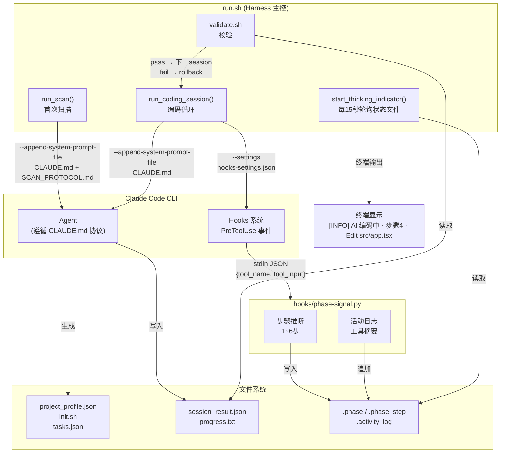
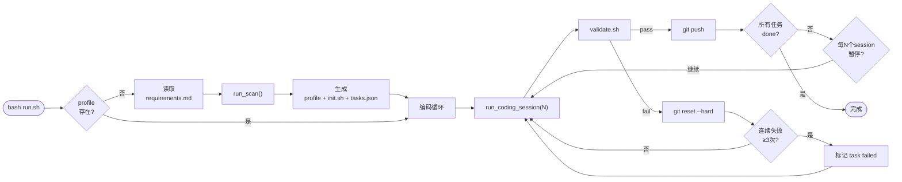
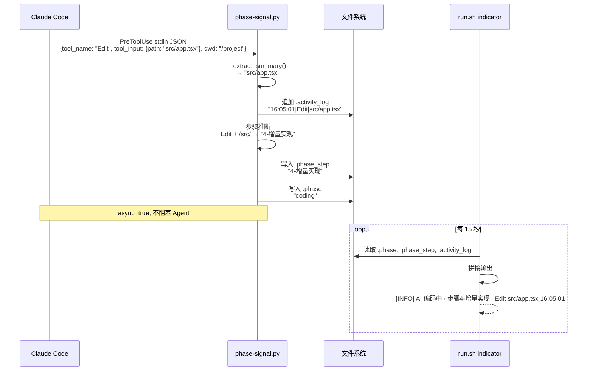
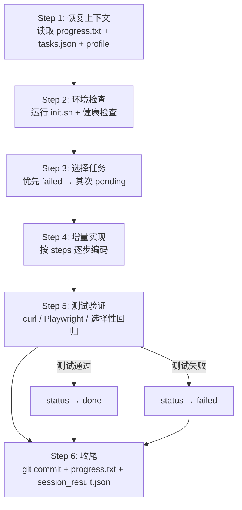
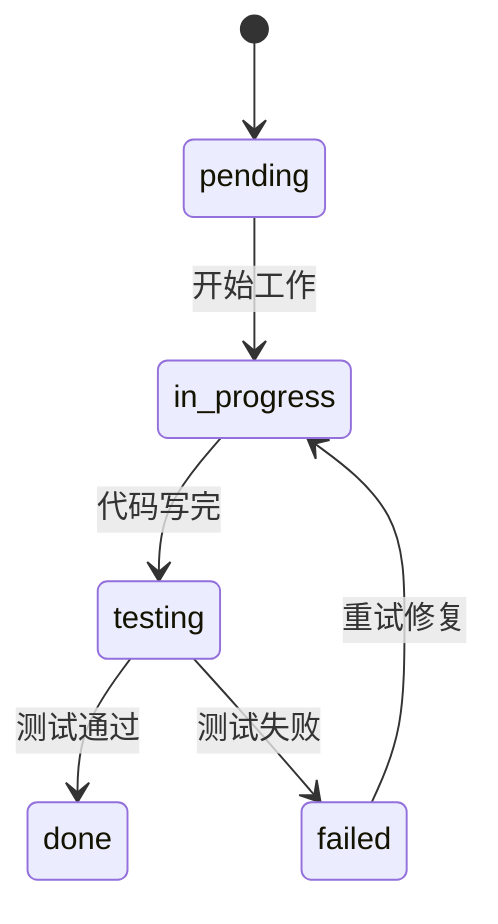

# Claude Auto Loop — 架构概述

> 本文件面向 AI Agent 和开发者，用于快速理解本工具的设计、文件结构和扩展方式。
> 修改工具前请先阅读本文件。

## 定位

一个 **通用的 Claude Code 自动编码 harness**。它将 Claude Code CLI 包装为一个循环引擎：自动扫描项目 → 拆解任务 → 逐个实现 → 校验 → 推送，无需人工干预（可在暂停点确认）。

核心特征：
- **项目无关**：所有项目信息由 Agent 扫描后存入 `project_profile.json`，工具本身不含任何项目特定逻辑
- **可恢复**：通过 `progress.txt` 跨会话记忆，任意 session 可断点续跑
- **可观测**：通过 PreToolUse hook 实时显示 Agent 当前步骤和最近工具调用

## 整体架构



## 执行流程（首次运行 vs 后续运行）



## Hook 数据流（每次工具调用）



## Agent 6 步工作流（单个 Session 内部）



## 任务状态机



## 文件清单

### 工具核心（随 upstream 分发，update.sh 会覆盖）

| 文件 | 用途 |
|------|------|
| `CLAUDE.md` | Agent 协议：铁律、6 步流程、状态机、文件权限（注入为 system prompt） |
| `SCAN_PROTOCOL.md` | 首次扫描专用协议（与 CLAUDE.md 拼接后注入） |
| `ARCHITECTURE.md` | 本文件：工具架构概述 |
| `run.sh` | Harness 主控：扫描、编码循环、进度指示、错误回滚 |
| `setup.sh` | 交互式配置向导：模型选择、MCP、API Key |
| `validate.sh` | 独立校验脚本：session_result、git、健康检查、自定义钩子 |
| `update.sh` | 从 upstream 拉取最新代码（排除法，自动同步新增文件） |
| `hooks-settings.json` | Claude Code hooks 配置（PreToolUse 事件注册） |
| `hooks/phase-signal.py` | PreToolUse hook：步骤推断 + 活动日志写入 |
| `cursor.mdc` | Cursor IDE 规则文件（复制到 `.cursor/rules/`） |
| `requirements.example.md` | 需求文件模板 |
| `README.md` / `README.en.md` | 用户文档 |
| `.gitignore` | 排除运行时文件 |

### 项目运行时数据（由 Agent 生成，update.sh 不覆盖）

| 文件 | 生成时机 | 用途 |
|------|----------|------|
| `project_profile.json` | 首次扫描 | 项目元数据：技术栈、服务、健康检查 URL |
| `init.sh` | 首次扫描 | 环境初始化脚本（幂等设计） |
| `tasks.json` | 首次扫描 | 功能任务列表 + 状态跟踪 |
| `progress.txt` | 每次 session 结束 | 跨会话记忆日志（只追加） |
| `session_result.json` | 每次 session 结束 | 本次会话的结构化输出 |
| `tests.json` | 首次测试时（Agent 自动创建） | 测试用例注册表（选择性回归） |
| `sync_state.json` | 需求同步时 | 需求 hash 同步状态 |
| `config.env` | setup.sh 生成 | 模型配置 + API Key（gitignored） |

### 运行时临时文件（session 生命周期，自动清理）

| 文件 | 写入者 | 读取者 | 用途 |
|------|--------|--------|------|
| `.phase` | `phase-signal.py` | `run.sh` indicator | 当前阶段：thinking / coding |
| `.phase_step` | `phase-signal.py` | `run.sh` indicator | 当前步骤：1-恢复上下文 ~ 6-收尾 |
| `.activity_log` | `phase-signal.py` | `run.sh` indicator | 最近工具调用摘要（滚动日志） |
| `requirements_hash.current` | `run.sh` | Agent | 需求同步触发条件 |
| `logs/*.log` | `run.sh` | 开发者 | session 和校验日志 |

## Hook 系统

Claude Code 的 hooks 是 **进程外设计**（不是 in-process callback）。Hook handler 是独立进程，通过 stdin 接收 JSON，通过 stdout/exit code 返回结果。

### 配置

```json
{
  "hooks": {
    "PreToolUse": [{
      "matcher": "*",
      "hooks": [{
        "type": "command",
        "command": "\"$CLAUDE_PROJECT_DIR\"/claude-auto-loop/hooks/phase-signal.py",
        "async": true
      }]
    }]
  }
}
```

注入方式：`run.sh` 通过 `--settings hooks-settings.json` 传递给 `claude` CLI。

### 可用的 hook 事件（Claude Code 原生支持）

| 事件 | 触发时机 | 本工具是否使用 |
|------|----------|----------------|
| `PreToolUse` | 工具调用前 | **是**（步骤推断 + 活动日志） |
| `PostToolUse` | 工具调用成功后 | 否（PreToolUse 已足够） |
| `SessionStart/End` | 会话开始/结束 | 否 |
| `Stop` | Claude 停止响应 | 否 |
| `Notification` | 通知事件 | 否 |

## 扩展点

| 扩展需求 | 方式 |
|----------|------|
| 增加校验逻辑 | 在 `validate.d/` 放 `.sh` 脚本，validate.sh 自动加载 |
| 增加 hook 事件 | 修改 `hooks-settings.json`，在 `hooks/` 新增脚本 |
| 支持新模型 | 修改 `setup.sh` 添加提供商 |
| 定制 Agent 行为 | 修改 `CLAUDE.md`（但用户项目不应修改，由 upstream 维护） |

## 设计原则

1. **工具与项目分离**：`claude-auto-loop/` 是独立子目录，不污染项目结构
2. **排除法优于包含法**：`update.sh` 和 `.gitignore` 定义"要保护什么"而非"要包含什么"
3. **Agent 自治**：Agent 通过 CLAUDE.md 协议自主决策，harness 只负责调度和校验
4. **幂等设计**：`init.sh`、`run.sh` 可重复执行，不产生副作用
5. **最小依赖**：仅需 `claude` CLI + `python3` + `git`，无 Node/jq 等额外依赖
