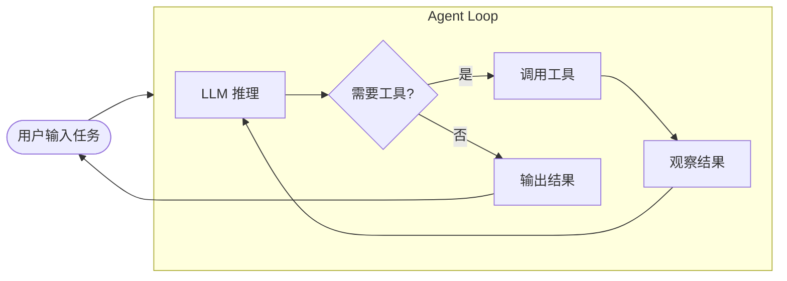
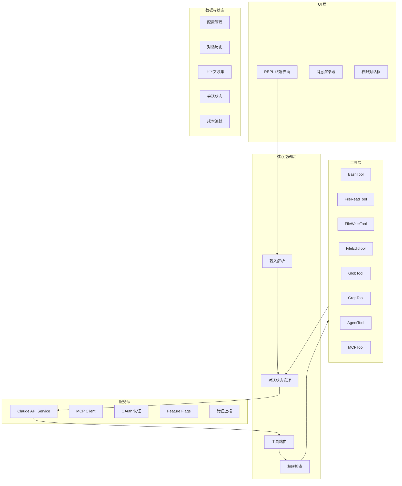
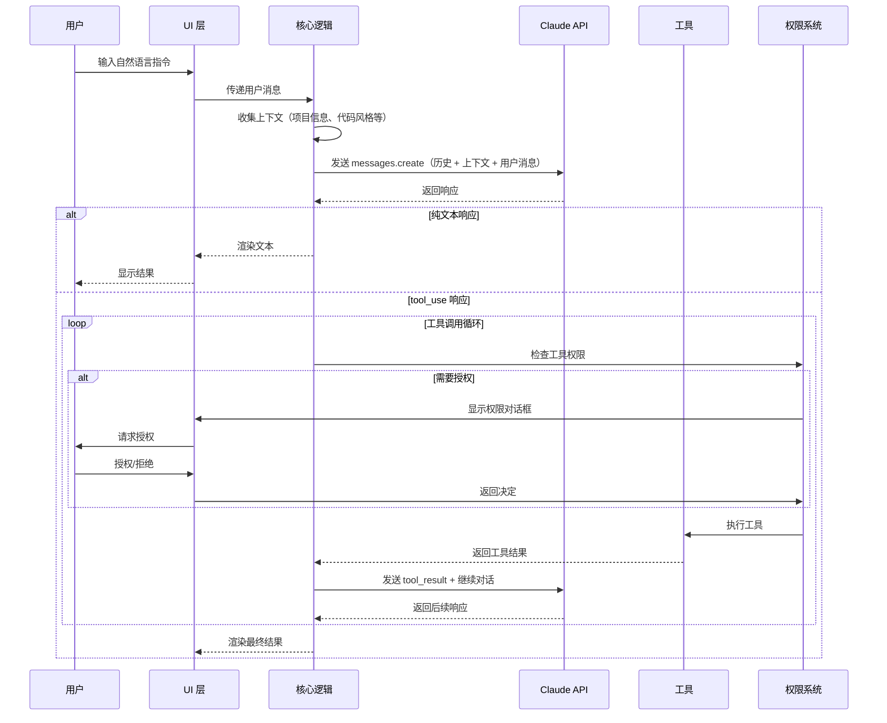
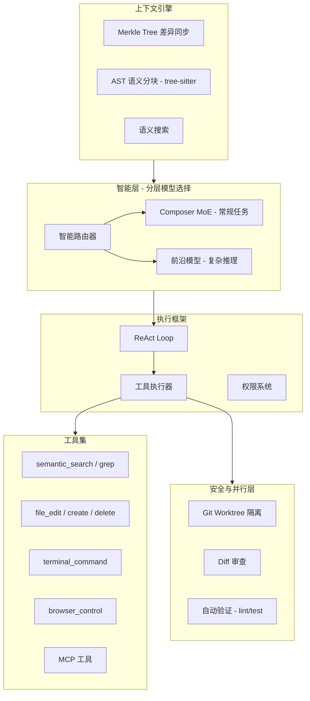
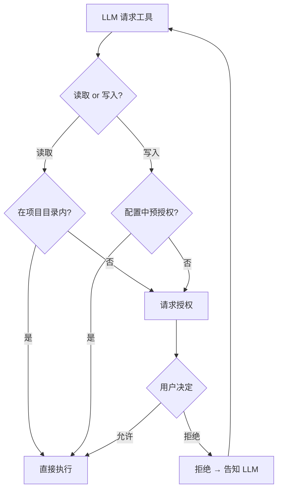

# AI Coding Agent 架构深度解析

> 本文档是一份可直接学习的教材，基于公开的逆向工程分析、技术博客和官方文档，深度解析 Claude Code 与 Cursor Agent 的内部架构，提炼出构建 AI Coding Agent 的核心模式。

---

## 目录

1. [什么是 AI Coding Agent](#1-什么是-ai-coding-agent)
2. [Claude Code 架构全貌](#2-claude-code-架构全貌)
3. [Cursor Agent 架构全貌](#3-cursor-agent-架构全貌)
4. [核心模式提炼](#4-核心模式提炼)
5. [两者对比分析](#5-两者对比分析)
6. [SDK 与框架生态](#6-sdk-与框架生态)
7. [延伸阅读](#7-延伸阅读)

---

## 1. 什么是 AI Coding Agent

传统的 AI 编程助手（如 GitHub Copilot 早期版本）是**单轮自动补全**——你写代码，它猜下一行。AI Coding Agent 完全不同，它是一个**自主循环系统**：接收任务 → 分析代码库 → 规划步骤 → 调用工具执行 → 观察结果 → 继续或报告完成。

核心区别在于 **Agent Loop**（代理循环）：LLM 不再是"回答问题的函数"，而是循环中的"决策大脑"，每一轮决定下一步该做什么。



这个循环就是所有 AI Coding Agent 的骨架——Claude Code、Cursor、Codex CLI、Windsurf 无一例外。

---

## 2. Claude Code 架构全貌

### 2.1 技术栈

| 层级 | 技术选型 |
|------|----------|
| 语言 | TypeScript |
| 运行时 | Node.js (>=18) |
| 终端 UI | React + [Ink](https://github.com/vadimdemedes/ink)（React 渲染到终端） |
| LLM 通信 | Anthropic Messages API（Beta，支持 tool_use） |
| 打包方式 | 单文件 bundle（cli.js），非开源 |
| 外部工具协议 | MCP（Model Context Protocol） |

### 2.2 分层架构

Claude Code 采用经典的分层设计，职责清晰：



### 2.3 完整数据流

一次完整的用户交互，数据如何流转：



### 2.4 工具系统详解

Claude Code 的强大来自其工具集。每个工具本质上是一个**函数 + JSON Schema 描述**，LLM 通过 `tool_use` 机制调用：

**读取类工具**（不修改环境）：

- **FileReadTool** — 读取文件内容，支持行范围读取和图片（base64）
- **GlobTool** — 通过模式匹配搜索文件名（如 `**/*.ts`），按修改时间排序
- **GrepTool** — 用正则搜索文件内容
- **LSTool** — 目录树浏览

**写入类工具**（修改环境，需要权限）：

- **FileWriteTool** — 写入/覆盖整个文件
- **FileEditTool** — 精确替换：`old_string → new_string`，要求足够上下文保证唯一性
- **BashTool** — 执行任意 bash 命令，维护持久 shell 会话（工作目录和环境变量跨调用保持）
- **NotebookEditTool** — 编辑 Jupyter Notebook 的 cell

**编排类工具**：

- **AgentTool** — 启动一个独立的子代理，拥有独立上下文窗口和受限工具集，完成后返回报告。用于并行化或隔离子任务
- **MCPTool** — 连接外部 MCP 服务器提供的工具（数据库、浏览器、API 等）
- **ThinkTool** — 让 LLM "自言自语"记录推理过程，不执行任何动作

**工具调用的底层机制**：Anthropic Messages API 的 `tool_use` 协议：

```
用户消息 → LLM → stop_reason: "tool_use" → 提取 tool name + input
→ 执行工具 → 将结果作为 tool_result 消息 → 继续对话
```

LLM 在一次响应中可以请求**多个**工具调用，引擎按顺序执行并把所有结果一次性返回。

### 2.5 权限系统

Claude Code 的权限设计是一个值得学习的安全模式：

- **初始信任对话**：首次运行时授予基本读取权限
- **分层检查**：先查配置中的预授权规则 → 未匹配则弹出用户授权对话框
- **临时 vs 永久**：用户可以选择"本次允许"或"永远允许"
- **拒绝反馈**：拒绝执行后，拒绝原因作为 tool_result 返回给 LLM，让它调整策略
- **文件写权限传递**：授权修改文件后，同时获得该目录的 session 级写权限

### 2.6 子代理机制

AgentTool 是 Claude Code 实现复杂任务分解的关键：

- 主代理可以启动子代理，子代理有**独立的上下文窗口**
- 子代理默认只有读取工具，避免副作用
- 子代理完成后返回文本报告，主代理据此继续
- 这种设计保护了主代理的上下文不被子任务的大量中间信息污染

### 2.7 Claude Agent SDK 的本质

`@anthropic-ai/claude-agent-sdk`（TypeScript 版）的工作方式：

```
你的代码 → sdk.query() → 启动 Claude Code CLI 子进程
→ CLI 内部运行完整的 Agent Loop（LLM 调用 + 工具执行）
→ 通过 AsyncGenerator 流式返回消息给你的代码
```

所以 **SDK 不是一个轻量封装**，它实际上启动了完整的 Claude Code 运行时。你调 `query()` 时，背后有一个完整的 Node.js 进程在跑 Agent Loop、执行工具、管理权限。

这意味着：
- 你的 ai-helper 项目本质上是 Claude Code 之上的**任务编排层**（循环分配任务、管理状态、推送代码）
- 真正的 Agent Loop 在 SDK/CLI 内部，你并没有自己实现

---

## 3. Cursor Agent 架构全貌

### 3.1 技术栈

| 层级 | 技术选型 |
|------|----------|
| 语言 | TypeScript / JavaScript |
| 运行时 | Electron（VS Code fork） |
| 编辑器 | Monaco Editor（VS Code 核心） |
| 自研模型 | Composer（MoE 架构，250 tokens/s） |
| 外部模型 | Claude、GPT 系列、Gemini |
| 并行隔离 | Git Worktree |
| 上下文同步 | Merkle Tree |
| 代码解析 | tree-sitter（AST） |
| 外部工具协议 | MCP |

### 3.2 分层架构

Cursor 的架构比 Claude Code 更复杂，因为它是一个完整的 IDE，但 Agent 部分的核心同样遵循 ReAct 模式：



### 3.3 智能层：分层模型选择

这是 Cursor 与 Claude Code 最大的架构差异。Cursor 不是"一个模型打天下"：

**智能路由器**将任务分为两类：
- **常规任务**（样板代码、简单重构）→ 路由到 **Composer**（自研 MoE 模型，只激活部分专家，低延迟高吞吐）
- **复杂任务**（架构设计、遗留代码迁移）→ 路由到 **前沿模型**（Claude 4.5、GPT-5 等）

这种设计的核心考量是**成本和延迟**：Agent 在一次任务中可能调用 LLM 几十次，如果每次都用最贵的模型，费用和等待时间都不可接受。

### 3.4 上下文引擎

上下文管理是 Coding Agent 最核心的工程挑战。Cursor 的方案：

**Merkle Tree 差异同步**：
- 每个文件计算 hash，向上逐层聚合形成树状指纹
- 文件修改时只更新路径上的 hash，与服务端比对只同步差异
- 实现毫秒级代码库状态同步，确保 Agent 的"世界观"始终最新

**AST 语义分块**：

传统 RAG 按字符数切分文档，会把函数、类切断。Cursor 用 tree-sitter 将代码解析为 AST（抽象语法树），然后按**逻辑单元**分块：

```
传统文本分块:    "...end of function A\n\nfunction B(x) {\n  if (x >..."  ← 逻辑被切断
AST 语义分块:    [完整的 function A] [完整的 function B]                   ← 逻辑完整
```

这确保检索出的上下文片段是**语义完整**的——一个完整的函数、一个完整的类，而不是被截断的文本碎片。

### 3.5 执行框架

Cursor 的 Agent Loop 与 Claude Code 类似，但在执行细节上有特色：

**隐式上下文注入**：每次用户发送消息时，Cursor 在用户看不到的地方注入大量上下文：
- 当前打开的文件
- Git 状态
- Cursor Rules（项目规则）
- 终端状态
- Linter 错误
- 最近编辑的文件

用户以为自己只发了一句话，实际上 LLM 收到的是一个信息丰富的上下文包。

**Speculative Edits（推测性编辑）**：

代码编辑场景中 90% 的内容不变。Cursor 利用这一点：
1. 将原始文件作为"草稿"
2. 大模型只在需要修改的地方生成新 token
3. 实现 250 tokens/s 的编辑速度（约 4 倍于常规生成）

### 3.6 并行与隔离

**Git Worktree 多代理并行**：
- 每个子代理在独立的 Git Worktree 中工作（共享仓库历史，独立工作目录）
- 最多 8 个代理同时工作，互不干扰
- 代理完成后，人类审查 diff 并决定是否合并
- 这解决了多代理共享文件系统时的冲突问题

### 3.7 子代理系统

Cursor 的子代理（Subagents）设计：
- **Explore 子代理**：专注于代码搜索和分析，有独立上下文隔离
- **Bash 子代理**：命令执行，隔离输出避免污染主上下文
- **Browser 子代理**：浏览器自动化，过滤掉 DOM 噪音
- 子代理可以前台（阻塞）或后台（并行）运行

---

## 4. 核心模式提炼

剥离产品差异，Claude Code 和 Cursor 共享以下核心架构模式：

### 4.1 ReAct Loop（推理-行动循环）

所有 AI Coding Agent 的心脏。伪代码：

```javascript
const messages = [{ role: 'system', content: systemPrompt }];

while (true) {
  // 获取用户输入（首轮或工具循环结束后）
  if (lastStopReason !== 'tool_use') {
    const userInput = await getUserInput();
    messages.push({ role: 'user', content: userInput });
  }

  // 调用 LLM
  const response = await llm.create({ messages, tools });
  messages.push({ role: 'assistant', content: response.content });

  // 处理响应
  if (response.stop_reason === 'end_turn') {
    // LLM 认为任务完成，等待用户下一轮输入
    displayResult(response);
  } else if (response.stop_reason === 'tool_use') {
    // 执行工具，结果放回消息列表，继续循环
    const toolResults = await executeTools(response.toolCalls);
    messages.push({ role: 'user', content: toolResults });
  }
}
```

关键设计决策：
- **消息列表是核心状态**：整个 Agent 的"记忆"就是 messages 数组
- **stop_reason 驱动循环**：`tool_use` → 继续自主工作；`end_turn` → 等待用户
- **工具结果作为 user 消息**：这是 API 协议要求，tool_result 必须在 user 角色下

### 4.2 Tool Registry（工具注册表）

工具 = 函数 + JSON Schema。注册表模式：

```javascript
const toolRegistry = {
  read_file: {
    schema: {
      name: 'read_file',
      description: '读取文件内容',
      input_schema: {
        type: 'object',
        properties: {
          path: { type: 'string', description: '文件路径' }
        },
        required: ['path']
      }
    },
    execute: async ({ path }) => fs.readFile(path, 'utf-8')
  },
  // ... 更多工具
};
```

LLM 只看到 schema（决定调用什么），运行时根据 name 查找并执行 execute 函数。

### 4.3 上下文窗口管理

LLM 有 token 上限。随着对话轮次增加，messages 会超出限制。常见策略：

| 策略 | 做法 | 场景 |
|------|------|------|
| 裁剪历史 | 移除最早的消息 | 简单实现 |
| 摘要压缩 | 用 LLM 将旧消息压缩为摘要 | Claude Code 的 PreCompact hook |
| 子代理隔离 | 子任务在独立上下文中执行，只返回结果 | Claude Code AgentTool, Cursor Subagents |
| 按需加载 | 不预加载所有文件，通过工具按需读取 | 两者都采用 |

### 4.4 权限与安全

核心原则：**读取免授权，写入需授权，外部操作强授权**。



---

## 5. 两者对比分析

| 维度 | Claude Code | Cursor |
|------|-------------|--------|
| **形态** | 终端 CLI 工具 | IDE（VS Code fork） |
| **语言** | TypeScript / Node.js | TypeScript / Electron |
| **模型策略** | 单模型（Claude） | 分层路由（Composer + 前沿模型） |
| **上下文同步** | 按需工具读取 | Merkle Tree 主动同步 |
| **代码理解** | 依赖 LLM 理解 | AST 解析 + 语义分块 |
| **并行能力** | AgentTool 子代理 | Git Worktree 多代理 |
| **UI 交互** | 终端文本流 | IDE 内嵌面板 + diff 预览 |
| **速度优化** | 依赖 API 端 | Speculative Edits（250 tok/s） |
| **开放性** | SDK 可编程（但封装层） | 闭源，不可编程 |
| **最佳场景** | 自动化流水线、CI/CD | 交互式开发 |

**关键洞察**：

Claude Code 的哲学是"简单工具 + 强模型"——把复杂性交给 LLM，工具层保持薄。
Cursor 的哲学是"工程优化"——用自研模型、AST 解析、推测性编辑等工程手段降低延迟和成本。

两种路径都有效，但对学习者的启示不同：
- 如果你想**快速构建**，学 Claude Code 的模式（薄工具层 + API 调用）
- 如果你想**极致优化**，学 Cursor 的模式（分层路由 + 上下文工程）

---

## 6. SDK 与框架生态

### 6.1 Claude Agent SDK 对比

| | TypeScript SDK | Python SDK |
|---|---|---|
| 包名 | `@anthropic-ai/claude-agent-sdk` | `claude-agent-sdk` |
| 开源 | 否（单文件 bundle） | **是**（MIT，GitHub 5683 星） |
| 工作方式 | 启动 Claude Code CLI 子进程 | 启动 Claude Code CLI 子进程 |
| 适合 | 直接使用 Claude Code 能力 | 直接使用 + **学习源码** |
| 版本 | 0.2.71 | 0.1.50 |

**学习建议**：读 Python SDK 的开源代码（[github.com/anthropics/claude-agent-sdk-python](https://github.com/anthropics/claude-agent-sdk-python)），理解 `query()` 函数、消息流、工具调用的完整实现。

### 6.2 为什么不用 LangChain？

Claude Code 和 Cursor 都**没有**使用 LangChain/LangGraph，而是直接调用 LLM API。原因：

**框架的代价**：
- LangChain 引入大量抽象层（Chain、Agent、Memory、Retriever），每一层都增加调试难度
- 对于 Coding Agent 这种高度定制的场景，框架的通用抽象反而是束缚
- 生产级 Agent 需要精细控制每一步的 token 使用、错误恢复、超时处理

**直接调 API 的优势**：
- 完全控制消息格式和上下文构建
- 无框架版本升级的兼容性风险
- 调试时看到的就是原始 API 请求/响应，没有中间层
- 性能开销最小

**什么时候用 LangGraph**：
- 当你需要复杂的多代理协作、持久化状态、人机交互暂停恢复时
- LangGraph 的图执行引擎和状态检查点在这些场景有价值
- 但对于"一个 Agent + 几个工具"的场景，直接写 while 循环更简单直接

### 6.3 Node.js 生态中的选择

| 方案 | 定位 | 适合 |
|------|------|------|
| 直接调 Anthropic API | 最底层，完全控制 | 构建生产级 Agent（推荐） |
| Vercel AI SDK | 多模型统一接口 + tool calling | 需要切换模型时 |
| LangChain.js | 全功能框架 | 快速原型验证 |
| Claude Agent SDK | Claude Code 完整能力 | 不需要自己实现 Agent Loop |

---

## 7. 延伸阅读

### 架构分析

- [Reverse engineering Claude Code](https://www.reidbarber.com/blog/reverse-engineering-claude-code) — Reid Barber 对 Claude Code 内部的全面逆向分析
- [Claude Code Reverse Engineering (v2)](https://yuyz0112.github.io/claude-code-reverse/) — 运行时 API 抓包分析方法
- [Designing high-performance agentic systems](https://medium.com/@khayyam.h/designing-high-performance-agentic-systems-an-architectural-case-study-of-the-cursor-agent-ab624e4a0a64) — Cursor Agent 架构深度案例研究
- [I Reverse-Engineered Cursor's AI Agent](https://dev.to/vikram_ray/i-reverse-engineered-cursors-ai-agent-heres-everything-it-does-behind-the-scenes-3d0a) — Cursor Agent 逆向工程

### 实战参考

- [nano-claude-code](https://github.com/cthiriet/nano-claude-code) — 200 行实现的最小 Claude Code（JavaScript/Bun）
- [claude-agent-sdk-python](https://github.com/anthropics/claude-agent-sdk-python) — Anthropic 官方 Python SDK（开源，可读源码）
- [Build a coding agent with GPT](https://cookbook.openai.com/examples/build_a_coding_agent_with_gpt-5.1) — OpenAI 官方 coding agent 教程

### 官方文档

- [Claude Agent SDK Overview](https://docs.claude.com/en/docs/agent-sdk/overview) — Anthropic 官方 SDK 文档
- [Anthropic Tool Use Guide](https://docs.anthropic.com/en/docs/build-with-claude/tool-use/overview) — 工具调用协议详解
- [Cursor Subagents](https://cursor.com/docs/subagents.md) — Cursor 子代理文档

### 进阶理论

- [AI Workflow Orchestration in Production](https://aiworkflowlab.dev/article/ai-workflow-orchestration-in-production-building-durable-agent-pipelines-with-langgraph-and-temporal) — LangGraph + Temporal 的生产级编排
- [Building a Production-Grade AI Agent from Scratch in 2026](https://pub.towardsai.net/building-a-production-grade-ai-agent-from-scratch-in-2026-a-principles-first-guide-5b21754dc201) — 从原则出发的构建指南
