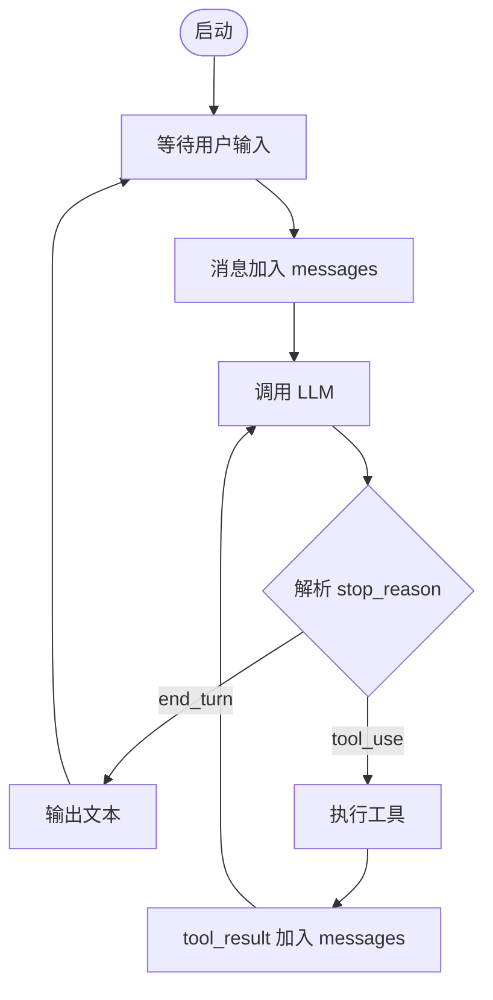
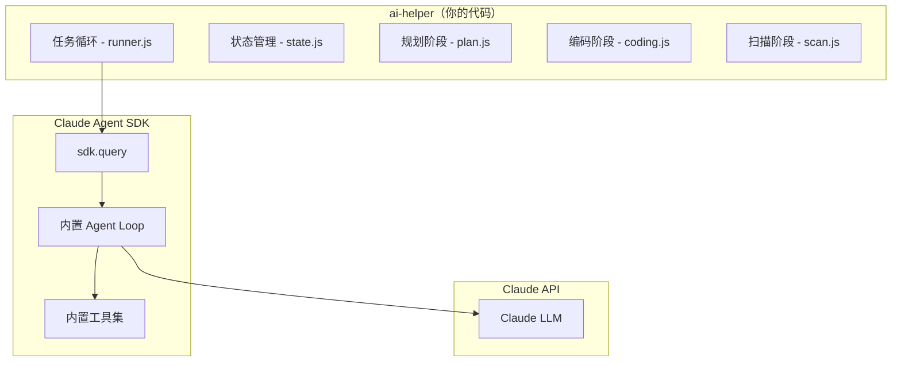

# Node.js AI Coding Agent 实战构建指南

> 本文档是一份分阶段的实战指南，教你用 Node.js 从零构建一个可工作的 AI Coding Agent。每个阶段有明确的目标、完整的代码示例和验证标准。

---

## 目录

1. [前置知识](#1-前置知识)
2. [Phase 1：最小 Agent Loop](#2-phase-1最小-agent-loop)
3. [Phase 2：工具集实现](#3-phase-2工具集实现)
4. [Phase 3：上下文管理](#4-phase-3上下文管理)
5. [Phase 4：Hook 系统与 Streaming](#5-phase-4hook-系统与-streaming)
6. [从 ai-helper 演进](#6-从-ai-helper-演进)

---

## 1. 前置知识

### 你需要理解的核心概念

**Tool Calling 协议**：Anthropic Messages API 的工具调用不是"特殊功能"，而是一种**对话协议**：

```
messages: [
  { role: 'user', content: '读取 package.json' }
]
→ LLM 返回:
  stop_reason: 'tool_use'
  content: [
    { type: 'text', text: '我来读取这个文件。' },
    { type: 'tool_use', id: 'toolu_xxx', name: 'read_file', input: { path: 'package.json' } }
  ]

你执行工具后:
messages: [
  { role: 'user', content: '读取 package.json' },
  { role: 'assistant', content: [上面的 content] },
  { role: 'user', content: [
    { type: 'tool_result', tool_use_id: 'toolu_xxx', content: '{"name": "my-app", ...}' }
  ]}
]
→ 继续调 LLM → 它可以请求更多工具或直接回答
```

**关键理解**：tool_result 必须放在 `role: 'user'` 下，这是 API 协议规定。LLM 的每次 `tool_use` 响应后，你必须把所有工具结果收集好，作为下一条 user 消息发回。

### 依赖

```bash
npm init -y
npm install @anthropic-ai/sdk
```

确保设置环境变量：

```bash
export ANTHROPIC_API_KEY=your-api-key
```

---

## 2. Phase 1：最小 Agent Loop

**目标**：实现一个能对话、能调用工具的最小循环。约 80 行代码。

### 完整代码

```javascript
// agent.mjs
import Anthropic from '@anthropic-ai/sdk';
import * as readline from 'readline';

const client = new Anthropic();
const MODEL = 'claude-sonnet-4-20250514';

// ─── 工具定义 ──────────────────────────────────────────
const tools = [
  {
    name: 'read_file',
    description: '读取指定路径的文件内容',
    input_schema: {
      type: 'object',
      properties: {
        path: { type: 'string', description: '文件路径' }
      },
      required: ['path']
    }
  }
];

// ─── 工具执行 ──────────────────────────────────────────
import { readFile } from 'fs/promises';

async function executeTool(name, input) {
  switch (name) {
    case 'read_file':
      try {
        return await readFile(input.path, 'utf-8');
      } catch (e) {
        return `错误: ${e.message}`;
      }
    default:
      return `未知工具: ${name}`;
  }
}

// ─── Agent Loop ────────────────────────────────────────
async function agentLoop() {
  const messages = [];
  const rl = readline.createInterface({ input: process.stdin, output: process.stdout });
  const ask = (q) => new Promise(resolve => rl.question(q, resolve));

  console.log('AI Coding Agent 已启动。输入 exit 退出。\n');

  let stopReason = null;

  while (true) {
    // 非工具调用轮：获取用户输入
    if (stopReason !== 'tool_use') {
      const userInput = await ask('你: ');
      if (!userInput || userInput === 'exit') break;
      messages.push({ role: 'user', content: userInput });
    }

    // 调用 LLM
    const response = await client.messages.create({
      model: MODEL,
      max_tokens: 4096,
      tools,
      messages,
      system: '你是一个编程助手。使用工具帮助用户理解和修改代码。'
    });

    messages.push({ role: 'assistant', content: response.content });
    stopReason = response.stop_reason;

    // 处理响应
    const toolResults = [];

    for (const block of response.content) {
      if (block.type === 'text') {
        console.log(`\nAgent: ${block.text}\n`);
      } else if (block.type === 'tool_use') {
        console.log(`  [工具调用] ${block.name}(${JSON.stringify(block.input)})`);
        const result = await executeTool(block.name, block.input);
        console.log(`  [工具结果] ${result.substring(0, 200)}${result.length > 200 ? '...' : ''}`);
        toolResults.push({
          type: 'tool_result',
          tool_use_id: block.id,
          content: result
        });
      }
    }

    if (toolResults.length > 0) {
      messages.push({ role: 'user', content: toolResults });
    }
  }

  rl.close();
  console.log('再见！');
}

agentLoop();
```

### 运行和验证

```bash
node agent.mjs
```

验证标准：
- 输入 "你好" → 得到文本回复
- 输入 "读取 package.json 并告诉我项目名称" → Agent 自动调用 read_file → 解析并回答
- 输入 "exit" → 正常退出

### 这段代码做了什么



核心就是 **while 循环 + stop_reason 分支**。这就是所有 AI Agent 的骨架。

---

## 3. Phase 2：工具集实现

**目标**：添加完整的 Coding Agent 工具集——Bash、Write、Grep。

### 3.1 扩展工具定义

```javascript
const tools = [
  {
    name: 'read_file',
    description: '读取指定路径的文件内容。用于了解代码结构和内容。',
    input_schema: {
      type: 'object',
      properties: {
        path: { type: 'string', description: '文件路径' }
      },
      required: ['path']
    }
  },
  {
    name: 'write_file',
    description: '将内容写入指定路径的文件。如果文件已存在则覆盖。自动创建父目录。',
    input_schema: {
      type: 'object',
      properties: {
        path: { type: 'string', description: '文件路径' },
        content: { type: 'string', description: '要写入的完整文件内容' }
      },
      required: ['path', 'content']
    }
  },
  {
    name: 'execute_bash',
    description: '执行 bash 命令。用于运行测试、安装依赖、git 操作等。返回 stdout 和 stderr。',
    input_schema: {
      type: 'object',
      properties: {
        command: { type: 'string', description: '要执行的 bash 命令' }
      },
      required: ['command']
    }
  },
  {
    name: 'grep_search',
    description: '在目录中用正则表达式搜索文件内容。返回匹配的文件名和行。',
    input_schema: {
      type: 'object',
      properties: {
        pattern: { type: 'string', description: '正则表达式模式' },
        directory: { type: 'string', description: '搜索目录，默认当前目录' },
        include: { type: 'string', description: '文件名过滤，如 "*.js"' }
      },
      required: ['pattern']
    }
  },
  {
    name: 'list_files',
    description: '列出目录下的文件和子目录。用于了解项目结构。',
    input_schema: {
      type: 'object',
      properties: {
        path: { type: 'string', description: '目录路径，默认当前目录' },
        pattern: { type: 'string', description: 'glob 模式过滤，如 "**/*.ts"' }
      },
      required: []
    }
  }
];
```

### 3.2 工具执行器

```javascript
import { readFile, writeFile, mkdir } from 'fs/promises';
import { execSync } from 'child_process';
import { dirname } from 'path';
import { globSync } from 'fs';

async function executeTool(name, input) {
  try {
    switch (name) {
      case 'read_file':
        return await readFile(input.path, 'utf-8');

      case 'write_file':
        await mkdir(dirname(input.path), { recursive: true });
        await writeFile(input.path, input.content, 'utf-8');
        return `文件已写入: ${input.path}`;

      case 'execute_bash':
        try {
          const output = execSync(input.command, {
            encoding: 'utf-8',
            timeout: 30000,
            maxBuffer: 1024 * 1024
          });
          return output || '(命令执行成功，无输出)';
        } catch (e) {
          return `退出码 ${e.status}\nstdout: ${e.stdout || ''}\nstderr: ${e.stderr || ''}`;
        }

      case 'grep_search': {
        const dir = input.directory || '.';
        const includeFlag = input.include ? `--include="${input.include}"` : '';
        try {
          return execSync(
            `grep -rn ${includeFlag} "${input.pattern}" "${dir}" | head -50`,
            { encoding: 'utf-8', timeout: 10000 }
          );
        } catch (e) {
          return e.stdout || '无匹配结果';
        }
      }

      case 'list_files': {
        const dir = input.path || '.';
        try {
          return execSync(`find "${dir}" -maxdepth 3 -not -path '*/node_modules/*' -not -path '*/.git/*' | head -100`, {
            encoding: 'utf-8',
            timeout: 5000
          });
        } catch (e) {
          return e.stdout || `无法列出 ${dir}`;
        }
      }

      default:
        return `未知工具: ${name}`;
    }
  } catch (e) {
    return `工具执行错误: ${e.message}`;
  }
}
```

### 3.3 改进 System Prompt

System Prompt 的质量直接决定 Agent 的行为。参考 Claude Code 和 nano-claude-code 的做法：

```javascript
const SYSTEM_PROMPT = `你是一个 AI 编程助手，专门帮助用户理解、修改和创建代码。

## 工作方式

1. 先理解任务：仔细阅读用户的需求
2. 先探索再行动：用 read_file、grep_search、list_files 了解代码库现状
3. 制定计划：说明你打算怎么做
4. 执行修改：用 write_file 修改文件，用 execute_bash 运行命令
5. 验证结果：修改后用 execute_bash 运行测试或验证

## 重要规则

- 修改文件前，先读取文件了解当前内容
- 使用 grep_search 而不是盲目猜测代码位置
- 执行 bash 命令时注意安全，不要执行破坏性操作
- 每次修改后说明做了什么改动以及为什么
- 如果不确定，先问用户而不是猜测`;
```

### 验证标准

运行 Agent 后测试以下场景：
- "列出当前目录的文件" → 调用 list_files
- "搜索代码中所有 TODO 注释" → 调用 grep_search
- "创建一个 hello.js 文件，内容是打印 hello world" → 调用 write_file
- "运行 node hello.js" → 调用 execute_bash
- "读取 hello.js 并把输出改成 hello agent" → 先 read_file，再 write_file

---

## 4. Phase 3：上下文管理

**目标**：解决长对话中 token 溢出问题，让 Agent 能处理大型任务。

### 4.1 Token 计数与预算

```javascript
function estimateTokens(messages) {
  // 粗略估算：1 token ≈ 4 字符（英文）或 2 字符（中文）
  let total = 0;
  for (const msg of messages) {
    if (typeof msg.content === 'string') {
      total += Math.ceil(msg.content.length / 3);
    } else if (Array.isArray(msg.content)) {
      for (const block of msg.content) {
        if (block.type === 'text' || block.type === 'tool_result') {
          const text = typeof block.content === 'string' ? block.content : JSON.stringify(block);
          total += Math.ceil(text.length / 3);
        }
      }
    }
  }
  return total;
}
```

### 4.2 历史裁剪策略

当消息接近 token 上限时，需要裁剪。但不能随便删——删除 tool_use 而不删对应的 tool_result 会导致 API 报错。

```javascript
const MAX_CONTEXT_TOKENS = 150000; // 留一些余量给响应

function trimMessages(messages) {
  while (estimateTokens(messages) > MAX_CONTEXT_TOKENS && messages.length > 2) {
    // 保留第一条（通常是用户的初始任务描述）和最近的消息
    // 从第二条开始删除最旧的完整"对话轮"
    // 一轮 = user 消息 + assistant 响应 + 可能的 tool_result

    let removeEnd = 1; // 从 index 1 开始

    // 找到一个完整的轮次边界
    while (removeEnd < messages.length - 4) {
      const msg = messages[removeEnd];
      // 确保不在 tool_use/tool_result 对的中间切断
      if (msg.role === 'user' && !isToolResult(msg)) {
        break;
      }
      removeEnd++;
    }

    if (removeEnd >= messages.length - 4) break; // 安全退出

    // 用摘要替换被删除的消息
    const removed = messages.splice(1, removeEnd - 1);
    messages.splice(1, 0, {
      role: 'user',
      content: `[系统提示：之前有 ${removed.length} 条对话消息被压缩。请基于当前上下文继续工作。]`
    });
  }
  return messages;
}

function isToolResult(msg) {
  return Array.isArray(msg.content) &&
    msg.content.some(b => b.type === 'tool_result');
}
```

### 4.3 工具结果截断

大文件内容不需要完整保留在上下文中：

```javascript
const MAX_TOOL_RESULT_LENGTH = 10000;

function truncateToolResult(result) {
  if (result.length <= MAX_TOOL_RESULT_LENGTH) return result;

  const half = Math.floor(MAX_TOOL_RESULT_LENGTH / 2);
  const head = result.substring(0, half);
  const tail = result.substring(result.length - half);
  const omitted = result.length - MAX_TOOL_RESULT_LENGTH;
  return `${head}\n\n... [省略 ${omitted} 字符] ...\n\n${tail}`;
}
```

### 4.4 改进后的 Agent Loop

```javascript
async function agentLoop() {
  const messages = [];
  let stopReason = null;

  while (true) {
    if (stopReason !== 'tool_use') {
      const userInput = await ask('你: ');
      if (!userInput || userInput === 'exit') break;
      messages.push({ role: 'user', content: userInput });
    }

    // 发送前裁剪上下文
    trimMessages(messages);

    const response = await client.messages.create({
      model: MODEL,
      max_tokens: 4096,
      tools,
      messages,
      system: SYSTEM_PROMPT
    });

    messages.push({ role: 'assistant', content: response.content });
    stopReason = response.stop_reason;

    const toolResults = [];

    for (const block of response.content) {
      if (block.type === 'text') {
        console.log(`\nAgent: ${block.text}\n`);
      } else if (block.type === 'tool_use') {
        console.log(`  [工具] ${block.name}`);
        let result = await executeTool(block.name, block.input);
        result = truncateToolResult(result); // 截断过长的结果
        toolResults.push({
          type: 'tool_result',
          tool_use_id: block.id,
          content: result
        });
      }
    }

    if (toolResults.length > 0) {
      messages.push({ role: 'user', content: toolResults });
    }
  }
}
```

---

## 5. Phase 4：Hook 系统与 Streaming

### 5.1 Hook 系统

Hook 让你在工具执行前后注入自定义逻辑，实现日志、审计、权限控制等：

```javascript
class HookRegistry {
  constructor() {
    this.hooks = {
      preToolUse: [],
      postToolUse: [],
      onMessage: []
    };
  }

  register(event, callback) {
    if (this.hooks[event]) {
      this.hooks[event].push(callback);
    }
  }

  async emit(event, data) {
    for (const hook of this.hooks[event] || []) {
      const result = await hook(data);
      if (result?.abort) return result; // 允许 hook 中止操作
    }
    return null;
  }
}

// 使用示例
const hooks = new HookRegistry();

// 日志 hook
hooks.register('preToolUse', async ({ name, input }) => {
  console.log(`  [PRE] ${name} → ${JSON.stringify(input).substring(0, 100)}`);
});

// 权限 hook：拒绝危险命令
hooks.register('preToolUse', async ({ name, input }) => {
  if (name === 'execute_bash') {
    const dangerous = ['rm -rf', 'sudo', 'format', 'mkfs'];
    if (dangerous.some(d => input.command.includes(d))) {
      return { abort: true, reason: `命令被安全策略拒绝: ${input.command}` };
    }
  }
});

// 审计 hook
hooks.register('postToolUse', async ({ name, input, result }) => {
  if (name === 'write_file') {
    const fs = await import('fs/promises');
    await fs.appendFile('audit.log',
      `${new Date().toISOString()} | WRITE | ${input.path}\n`
    );
  }
});
```

在 Agent Loop 中集成 Hook：

```javascript
for (const block of response.content) {
  if (block.type === 'tool_use') {
    // Pre hook
    const preResult = await hooks.emit('preToolUse', {
      name: block.name,
      input: block.input
    });

    let result;
    if (preResult?.abort) {
      result = `操作被拒绝: ${preResult.reason}`;
    } else {
      result = await executeTool(block.name, block.input);
    }

    // Post hook
    await hooks.emit('postToolUse', {
      name: block.name,
      input: block.input,
      result
    });

    toolResults.push({
      type: 'tool_result',
      tool_use_id: block.id,
      content: truncateToolResult(result)
    });
  }
}
```

### 5.2 Streaming 输出

Streaming 让用户实时看到 Agent 的思考过程，而不是等整个响应完成：

```javascript
async function streamingCall(messages) {
  const stream = client.messages.stream({
    model: MODEL,
    max_tokens: 4096,
    tools,
    messages,
    system: SYSTEM_PROMPT
  });

  const toolCalls = [];
  let currentToolInput = '';

  for await (const event of stream) {
    switch (event.type) {
      case 'content_block_start':
        if (event.content_block.type === 'text') {
          process.stdout.write('\nAgent: ');
        } else if (event.content_block.type === 'tool_use') {
          process.stdout.write(`\n  [工具调用] ${event.content_block.name}`);
          toolCalls.push({
            id: event.content_block.id,
            name: event.content_block.name,
            input: {}
          });
          currentToolInput = '';
        }
        break;

      case 'content_block_delta':
        if (event.delta.type === 'text_delta') {
          process.stdout.write(event.delta.text);
        } else if (event.delta.type === 'input_json_delta') {
          currentToolInput += event.delta.partial_json;
        }
        break;

      case 'content_block_stop':
        if (toolCalls.length > 0 && currentToolInput) {
          try {
            toolCalls[toolCalls.length - 1].input = JSON.parse(currentToolInput);
          } catch {}
        }
        break;

      case 'message_stop':
        process.stdout.write('\n');
        break;
    }
  }

  const finalMessage = await stream.finalMessage();
  return { message: finalMessage, toolCalls };
}
```

---

## 6. 从 ai-helper 演进

### 6.1 当前架构定位

你的 ai-helper 项目当前是 Claude Agent SDK 的**上层编排**：



你调 `sdk.query()` 时，完整的 Agent Loop 在 SDK 内部运行。你并没有自己实现工具调用循环。

### 6.2 如果你想自己实现 Agent Loop

用本文档 Phase 1-4 的代码替换对 `sdk.query()` 的依赖：

```
当前:  runner.js → sdk.query(prompt) → SDK 内部完成一切
目标:  runner.js → 你的 agentLoop(prompt) → 你控制每一步
```

**好处**：
- 完全控制工具调用过程（自定义工具、自定义权限）
- 可以在工具调用间插入自定义逻辑（状态保存、进度回调）
- 减少对闭源 SDK 的依赖
- 深入理解 Agent 编排的每个细节

**代价**：
- 需要自己实现和维护工具集
- 失去 SDK 内置的高级功能（MCP、子代理、权限系统）
- 需要处理更多边界情况（网络错误、token 溢出、并发控制）

### 6.3 渐进式演进路径

不需要一次性重写，可以渐进替换：

**第一步：理解当前依赖**

分析 ai-helper 对 SDK 的调用点，理解每次 `query()` 传入了什么参数、期望什么输出。

**第二步：并行实现**

在项目中新建一个 `src/core/agent.js`，实现自己的 Agent Loop。先不替换 SDK 调用，而是在测试中对比两者的行为。

**第三步：替换简单场景**

从最简单的场景开始替换——比如 `scan` 阶段只需要读取和分析代码，不需要写入。

**第四步：逐步扩展**

逐步把更复杂的场景（coding、repair）切换到你自己的 Agent Loop，根据需要添加工具和 Hook。

### 6.4 参考项目

| 项目 | 特点 | 链接 |
|------|------|------|
| nano-claude-code | 200 行最小实现，JavaScript/Bun | [github.com/cthiriet/nano-claude-code](https://github.com/cthiriet/nano-claude-code) |
| claude-agent-sdk-python | 官方开源 Python SDK，可读源码学习 | [github.com/anthropics/claude-agent-sdk-python](https://github.com/anthropics/claude-agent-sdk-python) |

---

## 附录：完整最小 Agent 代码清单

将 Phase 1-3 的代码组合，一个功能完整的最小 AI Coding Agent 约 200 行：

```
agent.mjs          - 入口 + Agent Loop + 上下文管理（~120 行）
tools.mjs          - 工具定义 + 执行器（~80 行）
```

核心结构：

```javascript
// agent.mjs 的骨架
import { tools, executeTool } from './tools.mjs';

const SYSTEM_PROMPT = '...';
const messages = [];

while (true) {
  if (stopReason !== 'tool_use') {
    messages.push({ role: 'user', content: await getUserInput() });
  }

  trimMessages(messages);

  const response = await client.messages.create({
    model, tools, messages, system: SYSTEM_PROMPT
  });

  messages.push({ role: 'assistant', content: response.content });

  const toolResults = [];
  for (const block of response.content) {
    if (block.type === 'text') display(block.text);
    if (block.type === 'tool_use') {
      const result = truncate(await executeTool(block.name, block.input));
      toolResults.push({ type: 'tool_result', tool_use_id: block.id, content: result });
    }
  }

  if (toolResults.length) messages.push({ role: 'user', content: toolResults });
  stopReason = response.stop_reason;
}
```

这就是全部。一个 `while` 循环，一个 `messages` 数组，几个工具函数。
Claude Code、Cursor 的核心也不过如此——区别在于工程化的深度：更多的工具、更好的上下文管理、更完善的错误恢复、更精细的权限控制。但骨架，就是这个循环。
