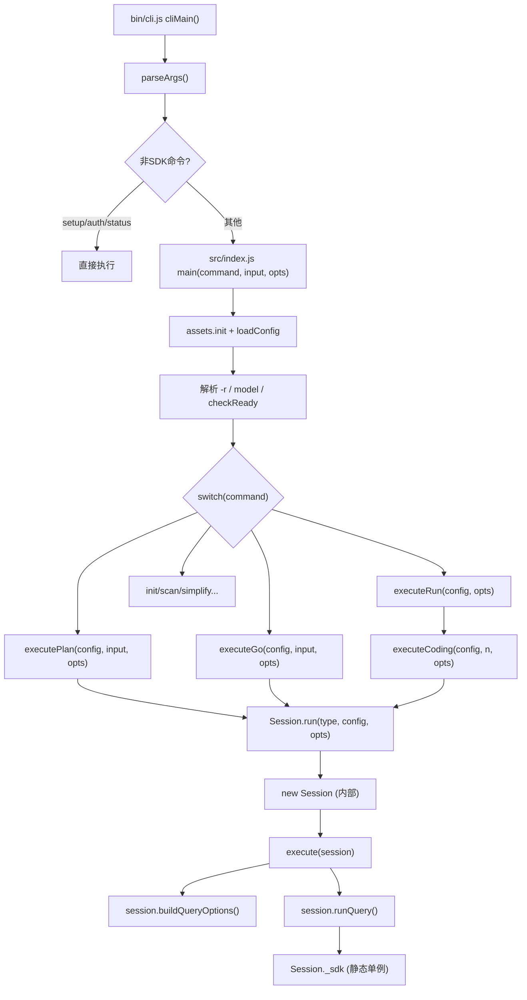

# 架构设计

```mermaid
flowchart TD
    CLI["bin/cli.js cliMain()"] --> ParseArgs["parseArgs()"]
    ParseArgs --> NonSDK{"非SDK命令?"}
    NonSDK -->|setup/auth/status| Direct["直接执行"]
    NonSDK -->|其他| Main["src/index.js main(command, input, opts)"]
    
    Main --> Init["assets.init + loadConfig"]
    Init --> Resolve["解析 -r / model / checkReady"]
    Resolve --> Dispatch{"switch(command)"}
    
    Dispatch --> Plan["executePlan(config, input, opts)"]
    Dispatch --> Go["executeGo(config, input, opts)"]
    Dispatch --> Run["executeRun(config, opts)"]
    Dispatch --> Others["init/scan/simplify..."]
    
    Plan --> SessionRun["Session.run(type, config, opts)"]
    Go --> SessionRun
    Run --> Coding["executeCoding(config, n, opts)"]
    Coding --> SessionRun
    
    SessionRun --> NewSession["new Session (内部)"]
    NewSession --> Execute["execute(session)"]
    Execute --> BuildQuery["session.buildQueryOptions()"]
    Execute --> RunQuery["session.runQuery()"]
    RunQuery --> SDK["Session._sdk (静态单例)"]
```