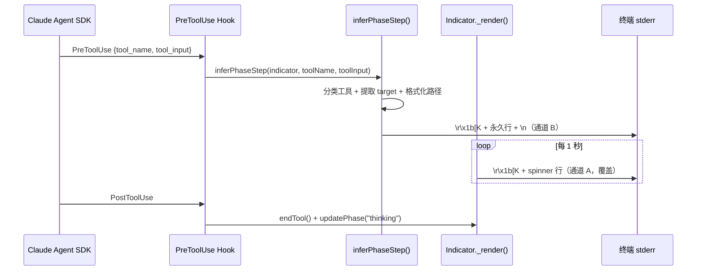

# 终端指示器机制

> 实现文件：`src/common/indicator.js`  
> 集成文件：`src/core/session.js`、`src/core/hooks.js`

---

## 一、双通道显示架构

终端输出采用**双通道**设计，彻底分离"心跳动画"与"工具操作日志"：

```
通道 A — Spinner 心跳（覆盖型）
  ⠇ S1 02:05 思考中              ← 每秒覆盖同一行，\r\x1b[K

通道 B — 永久工具行（追加型）
  [11:37:30] 00:12 Agent          ← 每次工具调用输出一行，以 \n 结尾
  [11:37:33] 00:14 Bash find . -maxdepth 2
  [11:37:38] 00:19 Read package.json
  [11:37:48] 00:30 Read src/App.tsx
  [11:38:07] 00:49 Bash git log --oneline -10
```

### 数据流



### 模型文本输出

当模型产出文本时，`session.js` 的 `_logMessage()` 会：

1. `pauseRendering()` — 暂停通道 A 定时器
2. `\r\x1b[K` — 清除当前 spinner 行
3. 输出模型文本到 stdout
4. `resumeRendering()` — 恢复通道 A

---

## 二、Indicator 类

### 属性

| 属性 | 类型 | 说明 |
|------|------|------|
| `phase` | `'thinking' \| 'coding'` | 当前阶段，影响 spinner 颜色 |
| `sessionNum` | `number` | 会话编号（S0、S1...） |
| `startTime` | `number` | 会话起始时间戳 |
| `lastActivityTime` | `number` | 最后一次活动时间戳（stall 检测用） |
| `toolRunning` | `boolean` | 工具执行中标志 |
| `toolStartTime` | `number` | 当前工具开始时间戳 |
| `projectRoot` | `string` | 项目根路径（路径归一化用） |

### 方法

| 方法 | 说明 |
|------|------|
| `start(sessionNum, stallTimeoutMin, projectRoot)` | 启动 1s 定时器 |
| `stop()` | 清除定时器 + 清空 spinner 行 |
| `startTool()` | 标记工具开始 + 重置 activity |
| `endTool()` | 标记工具结束 + 重置 activity（幂等） |
| `updatePhase(phase)` | 切换 thinking/coding |
| `updateActivity()` | 仅重置 lastActivityTime |
| `pauseRendering()` / `resumeRendering()` | 暂停/恢复 spinner |

### `_render()` — Spinner 行

每秒执行，始终覆盖同一行。格式：

```
⠇ S1 02:05 思考中
⠙ S1 02:06 编码中
⠸ S1 02:07 思考中 工具执行中 1:30     ← idle >= 2min 且 toolRunning
⠴ S1 12:00 思考中 5分无响应            ← idle >= 2min 且 !toolRunning
```

---

## 三、inferPhaseStep — 永久工具行

每次 `PreToolUse` hook 触发时调用，输出一行永久日志。

### 输出格式

```
  [HH:MM:SS] MM:SS ToolName target
  │          │     │        └─ 操作目标（文件路径/命令/pattern）
  │          │     └────────── 原始 SDK 工具名
  │          └──────────────── 会话已运行时长
  └─────────────────────────── 本地时间戳（灰色）
```

### 工具分类

| 工具名 | phase | target 来源 |
|--------|-------|-------------|
| `Write`、`Edit`、`MultiEdit`、`StrReplace` 等 | coding | `file_path` / `path` → `normalizePath` |
| `Bash`、`Shell` | coding/thinking | `command` → `extractBashCore` → `stripAbsolutePaths` |
| `Read`、`Glob`、`Grep`、`LS` | thinking | `extractTarget()` |
| `Task` | thinking | — |
| `WebSearch`、`WebFetch` | thinking | — |
| `mcp__*` | coding | `url` / `text` / `element` |
| 其他 | 不变 | — |

### Bash 子标签

`extractBashLabel(cmd)` 用于内部判断 phase，不再显示在工具名中：

| 子标签 | 匹配规则 | phase 影响 |
|--------|----------|-----------|
| Git | `cmd.includes('git ')` | — |
| npm/pnpm/yarn/pip | 正则匹配包管理器 | — |
| 网络 | `cmd.includes('curl')` | target 优先提取 URL |
| 测试 | `pytest/jest/test` | → coding |
| 执行 | `python/node` | → coding |

---

## 四、路径处理

### `normalizePath(raw, projectRoot)`

将绝对路径归一化为相对形式：

| 输入 | 输出 |
|------|------|
| `/Users/test/project/src/app.tsx`（projectRoot 匹配） | `src/app.tsx` |
| `/Users/test/.config/file` | `~/.config/file` |
| `/very/deep/path/a/b/c` | `.../a/b/c` |

### `stripAbsolutePaths(str, projectRoot)`

批量替换字符串中的绝对路径：

- `projectRoot + '/'` → `./`
- `$HOME + '/'` → `~/`

### `extractTarget(input, projectRoot)`

统一从工具 input 提取 target：`file_path` > `path` > `command` > `pattern`

---

## 五、终端宽度与 CJK 处理

### `termCols()`

```javascript
process.stderr.columns || process.stdout.columns || parseInt(process.env.COLUMNS, 10) || 70
```

优先 stderr（指示器输出目标），fallback 到 stdout / 环境变量 / 安全默认值 70。

### `isWideChar(codePoint)` / `displayWidth(str)`

CJK、全角字符占 2 列，ASCII 占 1 列。覆盖范围：

- CJK 统一汉字（U+4E00–U+9FFF）
- CJK 扩展 A/B（U+3400–U+4DBF, U+20000–U+2FA1F）
- 日文假名（U+3000–U+30FF）
- 全角字符（U+FF01–U+FF60, U+FFE0–U+FFE6）
- 韩文音节（U+AC00–U+D7AF）

### `clampLine(line, cols)`

截断超宽行，保留 ANSI 转义序列不计入宽度。超出部分以 `…` 替代。

---

## 六、实际终端效果

```
⠇ S1 00:05 思考中
  [11:37:30] 00:12 Agent
  [11:37:33] 00:14 Bash find . -maxdepth 2 -type d
  [11:37:36] 00:18 Bash ls -la
  [11:37:38] 00:19 Read package.json
  [11:37:40] 00:21 Read tsconfig.json
⠸ S1 00:22 思考中
  [11:37:42] 00:23 Bash ls -la src/
  [11:37:44] 00:25 Bash ls -la src/components/ src/types/
  [11:37:48] 00:30 Read src/App.tsx
  [11:37:50] 00:32 Read src/router/index.tsx
我来分析一下项目结构...          ← 模型文本输出（stdout，独占行）
  [11:38:07] 00:49 Bash git log --oneline -10
  [11:38:10] 00:51 Glob pattern: src/**
⠴ S1 01:00 思考中
  [11:38:36] 01:17 Write ~/.claude/plans/plan.md
----- SESSION END -----
```

---

## 七、涉及文件

| 文件 | 职责 |
|------|------|
| `src/common/indicator.js` | Indicator 类、inferPhaseStep、路径/宽度工具函数 |
| `src/core/hooks.js` | `createLoggingHook()` 调用 `inferPhaseStep`；`createEndToolHook()` 调用 `endTool` |
| `src/core/session.js` | `_logMessage()` 协调模型文本输出与 spinner 暂停/恢复 |
| `src/common/utils.js` | `localTimestamp()`、`truncateMiddle()`、`truncateCommand()` |
