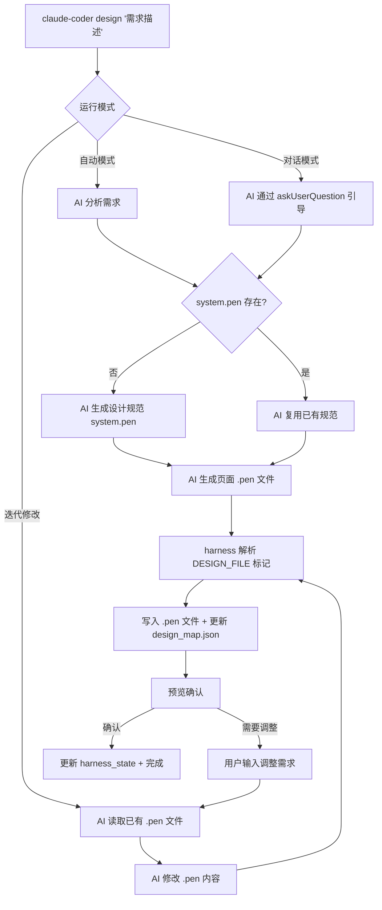

# UI Design Flow — 设计命令架构与联动方案

## 概述

`claude-coder design` 命令使用 Pencil 的 `.pen` 格式（纯 JSON）作为设计载体，支持通过自然语言生成和迭代修改 UI 原型。面向"一人 AI 公司"场景，实现**原型即 UI**的全自动设计能力。
[格式文档](https://docs.pencil.dev/for-developers/the-pen-format)
[格式文档](https://docs.pencil.dev/core-concepts/pen-files)
[技能文档](https://github.com/chiroro-jr/pencil-design-skill)

## 已知平台限制

> ⚠️ **Windows 已知限制**：`.pen` 文件的跨文件组件引用（`ref: "sys:header"`）在 Windows 的 Pencil 插件中不受支持（Pencil应用也不支持）。Mac 桌面应用、插件均正常预览。建议在 Mac 上使用 design 命令生成和预览设计稿。跨文件变量引用（`$sys:color.bg`）和同文件内组件引用在所有平台均可用。

## 核心决策

| 决策项 | 选择 | 理由 |
|--------|------|------|
| 设计格式 | Pencil `.pen` (JSON) | 纯 JSON 可被 AI 直接读写，无需 GUI 依赖；格式公开、Git 友好 |
| 存放位置 | `.claude-coder/design/` | 与 harness 产物一致；可通过 `DESIGN_DIR` 环境变量覆盖 |
| 映射管理 | `design_map.json` 独立文件 | AI 生成内容与 harness_state 分离，出错可独立修复 |
| 设计食材 | 不预设具体模板 | 风格/模式种类太多，AI 自主决策；通过 designSystem.md 提供方法论指导 |
| GUI 依赖 | 可选（非必须） | 生成时不需要 Pencil App；查看效果时可选打开 |

## 当前架构 (Phase 1 — design 命令)



## 文件结构

```
.claude-coder/
├── design/                       # 设计文件目录
│   ├── design_map.json           # 设计映射表（AI 生成，harness 管理）
│   ├── system.pen                # 项目设计规范（变量、基础组件）
│   └── pages/                    # 页面设计文件
│       ├── login.pen
│       ├── dashboard.pen
│       └── user-list.pen
├── .runtime/
│   └── harness_state.json        # design 字段存轻量指针
```

### design_map.json 结构

```json
{
  "version": 1,
  "designSystem": "system.pen",
  "pages": {
    "login": {
      "pen": "pages/login.pen",
      "description": "登录页面",
      "lastModified": "2026-03-18T..."
    }
  }
}
```

### harness_state.json 中的 design 字段

```json
{
  "design": {
    "lastFile": "pages/login.pen",
    "lastTimestamp": "2026-03-18T...",
    "designDir": ".claude-coder/design",
    "pageCount": 3
  }
}
```

## AI 输出协议

AI 使用 DESIGN_FILE 标记输出设计文件，harness 解析并写入磁盘：

```
DESIGN_FILE path=system.pen desc=设计规范
DESIGN_JSON_START
{"version":"1","variables":{...},"children":[...]}
DESIGN_JSON_END

DESIGN_FILE path=pages/login.pen desc=登录页面
DESIGN_JSON_START
{"version":"1","children":[...]}
DESIGN_JSON_END
```

harness 的 `extractDesignFiles()` 函数使用正则提取所有标记块，解析 JSON 后写入文件。

## AI 如何理解 .pen 文件中的 UI

`.pen` 文件是结构化的 JSON 对象树，AI 可以完全理解：

- **布局结构**：`frame` 的 `layout`/`gap`/`padding` → 理解页面布局
- **文本内容**：`text` 的 `content` → 理解界面文案
- **视觉样式**：`fill`/`stroke`/`cornerRadius` → 理解配色和圆角
- **组件关系**：`reusable`/`ref` → 理解组件复用关系
- **设计变量**：`variables`/`themes` → 理解设计规范

与截图不同，JSON 格式让 AI 能精确定位和修改任何元素。

---

## Pencil 安装与可视化预览

### 安装方式（任选其一）

- **Cursor/VS Code 插件**（推荐）：在扩展商店搜索 "Pencil" 安装，打开 .pen 文件自动渲染
- **桌面应用**：从 [pencil.dev](https://pencil.dev) 下载安装

### 预览流程

design 命令完成后，终端会显示：

```
✓ 设计完成！
ℹ 预览设计: 在 Cursor/VS Code 中打开 .pen 文件（需安装 Pencil 插件）
ℹ   打开命令: cursor ".claude-coder/design/pages/login.pen"
```

直接运行打开命令，即可在 Cursor 中看到 AI 生成的 UI 效果。

### 是否必须安装 Pencil？

**不是强制的。** 设计文件的生成和后续 plan/run 流程不依赖 Pencil。但如果你想：
- 可视化查看 AI 生成的 UI 效果 → 需要 Pencil
- 手动微调设计细节 → 需要 Pencil
- 纯自动化流程（设计→计划→编码）无需人工评审 → 不需要 Pencil

---

## 后续联动方案

### Phase 2 — plan 命令联动

**目标**：`claude-coder plan` 生成任务时自动关联设计文件。

**核心思路**：注入 `design_map.json` 路径，让 AI 自己探索设计文件并在任务中关联。

**改动点**：

1. `src/core/prompts.js` → `buildPlanPrompt()` 增加 `designHint`：

```javascript
function buildDesignHint() {
  if (!assets.exists('designMap')) return '';
  const designDir = assets.dir('design');
  return `项目已有 UI 设计文件，映射表: ${path.join(designDir, 'design_map.json')}。` +
    '请读取该文件了解可用的 .pen 设计文件，在生成任务时自行关联相关设计。';
}
```

2. `templates/planUser.md` 增加 `{{designHint}}` 占位符

3. AI 读取 design_map.json 后自行决定如何在任务中引用设计文件

### Phase 3 — run 命令联动

**目标**：编码时 AI 知道去哪里找设计文件。

**核心思路**：注入 design_map.json 路径，AI 按需读取相关 .pen 文件。

**改动点**：

1. `src/core/prompts.js` → `buildCodingContext()` 增加 `designHint`：

```javascript
function buildDesignHint() {
  if (!assets.exists('designMap')) return '';
  const designDir = assets.dir('design');
  return `如涉及 UI 实现，可读取 ${path.join(designDir, 'design_map.json')} 了解可用的 .pen 设计文件。` +
    '.pen 文件是 JSON 格式的 UI 设计描述，包含布局、样式、组件结构等信息，可直接用 Read 工具读取。';
}
```

2. AI 在编码时按需 Read .pen 文件（JSON 格式，直接可读），理解布局和样式后生成对应代码

3. 完成后可用已有的 Playwright MCP 打开页面截图，验证代码效果是否匹配设计

### Phase 4 — go 命令集成

**目标**：需求组装后可选自动生成 UI 设计。

**改动点**：

1. `src/core/go.js` → `executeGo()` 完成方案确认后，增加：

```javascript
const shouldDesign = await promptProceedToDesign();
if (shouldDesign) {
  const { executeDesign } = require('./design');
  await executeDesign(config, goContent, opts);
}
```

2. go 方案文档中增加"UI 页面"章节，design 命令可以读取

### Phase 5 — Pencil Headless CLI

**目标**：当 Pencil 发布 headless npm 包后，增强设计能力。

- 直接通过 MCP 操作 .pen 文件（当前是纯 JSON 读写）
- 自动导出截图用于 plan/run 阶段的 prompt
- 支持设计系统组件的高级操作
