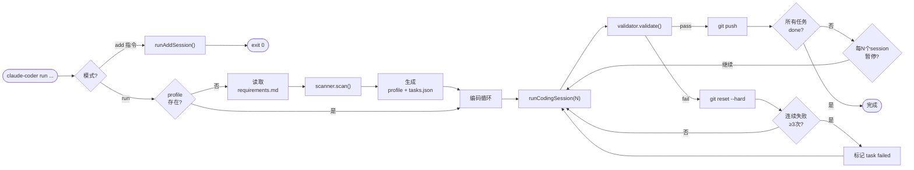
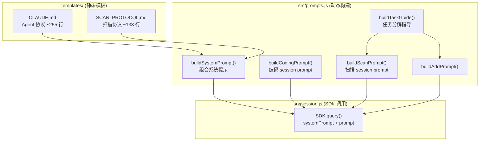
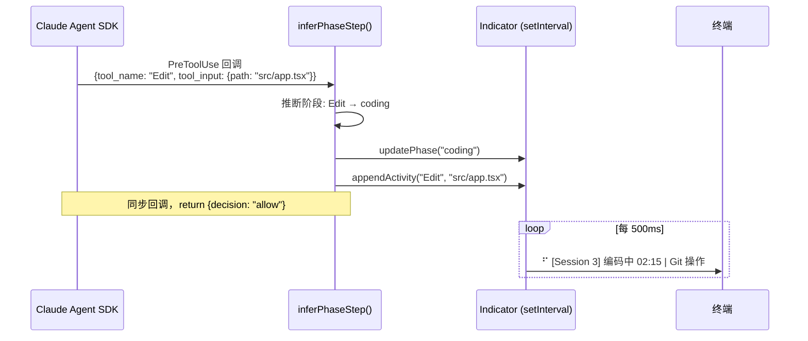
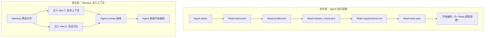

# Claude Coder — 技术架构文档

> 本文件面向开发者和 AI，用于快速理解本工具的设计、文件结构、提示语架构和扩展方向。

---

## 一句话定位

一个基于 Claude Agent SDK 的**自主编码 harness**：自动扫描项目 → 拆解任务 → 逐个实现 → 校验 → 回滚/重试 → 推送，全程无需人工干预。

---

## 1. 核心架构

```mermaid
flowchart TB
    subgraph Harness["bin/cli.js → src/runner.js (Harness 主控)"]
        direction TB
        scan["scanner.scan()<br/>首次扫描"]
        coding["session.runCodingSession()<br/>编码循环"]
        validate["validator.validate()<br/>校验"]
        indicator["Indicator 类<br/>setInterval 500ms 刷新"]
    end

    subgraph SDK["Claude Agent SDK"]
        query["query() 函数"]
        hook_sys["PreToolUse hook<br/>内联回调"]
    end

    subgraph Files["文件系统 (.claude-coder/)"]
        direction TB
        profile["project_profile.json<br/>tasks.json"]
        runtime["session_result.json<br/>progress.json"]
        phase[".runtime/<br/>phase / step / activity.log"]
    end

    scan -->|"systemPrompt =<br/>CLAUDE.md + SCAN_PROTOCOL.md"| query
    coding -->|"systemPrompt = CLAUDE.md"| query

    query -->|PreToolUse 事件| hook_sys
    hook_sys -->|inferPhaseStep()| indicator

    query -->|Agent 工具调用| Files
    validate -->|读取| runtime
    validate -->|"pass → 下一 session<br/>fail → rollback"| coding
```

**核心特征：**
- **项目无关**：项目信息由 Agent 扫描后存入 `project_profile.json`，harness 不含项目特定逻辑
- **可恢复**：通过 `session_result.json` 跨会话记忆，任意 session 可断点续跑
- **可观测**：SDK 内联 `PreToolUse` hook 实时显示 Agent 当前步骤和工具调用
- **跨平台**：纯 Node.js 实现，macOS / Linux / Windows 通用
- **零依赖**：`dependencies` 为空，Claude Agent SDK 作为 peerDependency

---

## 2. 执行流程



---

## 3. 模块职责

```
bin/cli.js          CLI 入口：参数解析、命令路由、SDK peerDep 检查
src/
  config.js         配置管理：.env 加载、模型映射、环境变量构建、全局同步
  runner.js         主循环：scan → session → validate → retry/rollback
  session.js        SDK 交互：query() 调用、hook 绑定、日志流
  prompts.js        提示语构建：系统 prompt 组合 + 条件 hint + 任务分解指导
  init.js           环境初始化：读取 profile 执行依赖安装、服务启动、健康检查
  scanner.js        初始化扫描：调用 runScanSession + 重试
  validator.js      校验引擎：session_result 结构校验 + git 检查 + 测试覆盖
  tasks.js          任务管理：CRUD + 状态机 + 进度展示
  indicator.js      进度指示：终端 spinner + phase/step 文件写入
  setup.js          交互式配置：模型选择、API Key、MCP 工具
templates/
  CLAUDE.md         Agent 协议（注入为 systemPrompt）
  SCAN_PROTOCOL.md  首次扫描协议（与 CLAUDE.md 拼接注入）
  requirements.example.md  需求文件模板
```

---

## 4. 文件清单

### npm 包分发内容

| 文件 | 用途 |
|------|------|
| `bin/cli.js` | CLI 入口 |
| `src/config.js` | .env 加载、模型映射 |
| `src/runner.js` | Harness 主循环 |
| `src/session.js` | SDK query() 封装 + hook |
| `src/prompts.js` | 提示语构建（系统 prompt + 条件 hint + 任务分解指导） |
| `src/init.js` | 环境初始化（依赖安装、服务启动） |
| `src/scanner.js` | 项目初始化扫描 |
| `src/validator.js` | 校验引擎 |
| `src/tasks.js` | 任务 CRUD + 状态机 |
| `src/indicator.js` | 终端进度指示器 |
| `src/setup.js` | 交互式配置向导 |
| `templates/CLAUDE.md` | Agent 协议 |
| `templates/SCAN_PROTOCOL.md` | 首次扫描协议 |

### 用户项目运行时数据（.claude-coder/）

| 文件 | 生成时机 | 用途 |
|------|----------|------|
| `.env` | `claude-coder setup` | 模型配置 + API Key（gitignored） |
| `project_profile.json` | 首次扫描 | 项目元数据 |
| `tasks.json` | 首次扫描 | 任务列表 + 状态跟踪 |
| `progress.json` | 每次 session 结束 | 结构化会话日志 + 成本记录 |
| `session_result.json` | 每次 session 结束 | 当前 + 历史 session 结果 |
| `tests.json` | 首次测试时 | 验证记录（防止反复测试） |
| `.runtime/` | 运行时 | 临时文件（phase、step、activity.log、logs/） |

---

## 5. Prompt 注入架构

### 架构图



### Session 类型与注入内容

| Session 类型 | systemPrompt | user prompt | 触发条件 |
|---|---|---|---|
| **编码** | CLAUDE.md | `buildCodingPrompt()` + 8 个条件 hint | 主循环每次迭代 |
| **扫描** | CLAUDE.md + SCAN_PROTOCOL.md | `buildScanPrompt()` + 任务分解指导 + profile 质量要求 | 首次运行 |
| **追加** | CLAUDE.md | `buildAddPrompt()` + 任务分解指导 | `claude-coder add` |

### 编码 Session 的 8 个条件 Hint

| # | Hint | 触发条件 | 影响 |
|---|---|---|---|
| 1 | `reqSyncHint` | 需求 hash 变化 | Step 1：追加新任务 |
| 2 | `mcpHint` | MCP_PLAYWRIGHT=true | Step 5：可用 Playwright |
| 3 | `testHint` | tests.json 有记录 | Step 5：避免重复验证 |
| 4 | `docsHint` | profile.existing_docs 非空或 profile 有缺陷 | Step 4：读文档后再编码；profile 缺陷时提示 Agent 在 Step 6 补全 services/docs |
| 5 | `envHint` | 连续成功且 session>1 | Step 2：跳过 init |
| 6 | `retryContext` | 上次校验失败 | 全局：避免同样错误 |
| 7 | `taskHint` | tasks.json 存在且有待办任务 | Step 1：跳过读取 tasks.json，harness 已注入当前任务上下文 |
| 8 | `memoryHint` | session_result.json 存在且有历史记录 | Step 1：跳过读取 session_result.json，harness 已注入上次会话摘要 |

---

## 6. 注意力机制与设计决策

### U 型注意力优化

CLAUDE.md 的内容按 LLM 注意力 U 型曲线排列：

```
顶部 (primacy zone)    → 铁律（约束规则）      → 最高遵循率
中部 (低注意力区)      → 参考数据（文件格式等） → 按需查阅
底部 (recency zone)    → 6 步工作流（行动指令） → 最高行为合规率
```

### 关键设计决策

| 决策 | 理由 |
|------|------|
| **静态规则 vs 动态上下文分离** | CLAUDE.md 是"宪法"（低频修改），hints 依赖运行时状态（动态生成） |
| **扫描协议单独文件** | 仅首次注入，编码 session 不需要，节省 ~2000 token |
| **任务分解指导在 user prompt** | 从系统 prompt 中部（低注意力）迁移到 user prompt（recency zone），提升遵循率 |
| **docsHint 动态注入** | 当 profile.existing_docs 非空时，在 user prompt 提醒 Agent 读文档再编码。CLAUDE.md Step 4 有静态指令，docsHint 在 recency zone 强化 |
| **tests.json 保留 last_run_session** | Agent 判断是否需要重新验证的依据（代码可能在中间 session 被修改） |
| **prompts.js 集中管理** | 所有 prompt 文本一处可见，与 session.js 的 SDK 交互职责分离 |

### 学术依据

| 优化项 | 理论来源 |
|---|---|
| U 型注意力布局 | Anthropic Context Engineering |
| DAG 依赖约束 | ACONIC (2025, arXiv 2510.07772) |
| 反面案例排除 | SCoT (2023) + Expert Context Framework |
| scan/add 复用 taskGuide | User Story Decomposition (SSRN 2025) |

---

## 7. Hook 数据流

SDK 的 hooks 是**进程内回调**（非独立进程），零延迟、无 I/O 开销：



---

## 8. 评分

| 维度 | 评分 | 说明 |
|------|------|------|
| **CLAUDE.md 系统提示** | 8/10 | U 型注意力设计；铁律清晰；状态机和 6 步流程是核心竞争力 |
| **动态 prompt** | 8.5/10 | 8 个条件 hint 精准注入，含 task/memory 上下文注入，减少 Agent 冗余 Read 调用 |
| **SCAN_PROTOCOL.md** | 8.5/10 | 新旧项目分支完整，profile 格式全面 |
| **tests.json 设计** | 7.5/10 | 精简字段，核心目的（防反复测试）明确 |
| **注入时机** | 9/10 | 静态规则 vs 动态上下文分离干净 |
| **整体架构** | 8/10 | 文件组织清晰，prompts.js 分离提升可维护性 |

---

## 9. Context Injection 架构（v1.0.4+）

### 设计原则

**Harness 准备上下文，Agent 直接执行。** Agent 不应浪费工具调用读取 harness 已知的数据。

### 优化前后对比



### Hint 7: 任务上下文注入

Harness 在 `buildCodingPrompt()` 中预读 `tasks.json`，将下一个待办任务的 id、description、category、steps 数量和整体进度注入 user prompt。Agent 无需自行读取 `tasks.json`。

### Hint 8: 会话记忆注入

Harness 在 `buildCodingPrompt()` 中预读 `session_result.json`，将上次会话的 task_id、结果和 notes 摘要注入 user prompt。Agent 无需自行读取历史 session 数据。

### Loop Detection（编辑死循环检测）

PreToolUse hook 中追踪每个文件的编辑次数。当同一文件被 Write/Edit 超过 5 次时，hook 返回 `decision: "block"` 阻止操作并提示 Agent 重新审视方案。

### 文件权限模型

| 文件 | 写入方 | Agent 权限 |
|------|--------|-----------|
| `progress.json` | Harness | 只读 |
| `sync_state.json` | Harness | 只读 |
| `session_result.json` | Agent 写 `current`，Harness 归档到 `history` | 写 `current` |
| `tasks.json` | Agent（仅 `status` 字段） | 修改 `status` |
| `project_profile.json` | Agent（仅扫描阶段） | 扫描时写入 |

---

## 10. Claude Agent SDK V1/V2 对比与迁移计划

当前使用 **V1 稳定 API**（`query()`），V2 为 preview 状态（`unstable_` 前缀）。

### V1 vs V2 API 对比

| 维度 | V1 `query()` | V2 `send()/stream()` |
|------|-------------|---------------------|
| **状态** | 稳定，生产可用 | `unstable_` 前缀，preview |
| **入口函数** | `query({ prompt, options })` | `unstable_v2_createSession(opts)` / `unstable_v2_prompt()` |
| **多轮会话** | 需手动管理 AsyncGenerator | `session.send()` + `session.stream()`，更简洁 |
| **会话恢复** | `options.resume: sessionId` | `unstable_v2_resumeSession(id)` |
| **Hooks** | `options.hooks: { PreToolUse, PostToolUse, ... }` | 未支持 |
| **Subagents** | `options.agents: { name: AgentDefinition }` | 未支持 |
| **Session Fork** | `options.forkSession: true` | 未支持 |
| **Plugins** | `options.plugins: [{ type, path }]` | 未支持 |
| **结构化输出** | `options.outputFormat: { type: 'json_schema', schema }` | 支持 |
| **文件检查点** | `options.enableFileCheckpointing + rewindFiles()` | 未明确 |
| **Cost Tracking** | `SDKResultMessage.total_cost_usd` | `SDKResultMessage.total_cost_usd` |
| **权限控制** | `canUseTool`, `permissionMode`, `allowedTools`, `disallowedTools` | 继承 |

### 当前实现使用的 V1 特性

```javascript
query({
  prompt,
  options: {
    systemPrompt,                      // 注入 CLAUDE.md
    allowedTools,                      // 工具白名单
    permissionMode: 'bypassPermissions',
    allowDangerouslySkipPermissions: true,
    model,                             // 从 .env 传入
    env,                               // 环境变量透传
    settingSources: ['project'],       // 加载项目 CLAUDE.md
    hooks: { PreToolUse: [...] },      // 实时 spinner 监控
  }
})
```

### V2 迁移条件（等待稳定后）

1. V2 去掉 `unstable_` 前缀，正式发布
2. V2 支持 Hooks（当前项目依赖 PreToolUse 做 spinner 和 activity log）
3. V2 支持 Subagents（未来可能用于扫描 Agent / 编码 Agent 分离）

### 可利用但尚未使用的 V1 特性

| 特性 | 说明 | 优先级 |
|------|------|--------|
| `maxBudgetUsd` | SDK 内置成本上限，替代自研追踪 | P0 |
| `effort` | 控制思考深度（`low`/`medium`/`high`/`max`） | P1 |
| `enableFileCheckpointing` | 文件操作检查点，比 git reset 更精细 | P1 |
| `outputFormat` | 结构化输出，让 Agent 直接输出 JSON 格式 | P1 |
| `agents` | 定义子 Agent，不同模型/工具集 | P2 |
| `betas` | 扩展上下文窗口 | P2 |

---

## 11. 后续优化方向

### P0 — 近期

| 方向 | 说明 |
|------|------|
| **文件保护 Deny-list** | PreToolUse hook 拦截对保护文件的写入（比文字规则更硬性） |
| **成本预算控制** | `.env` 新增 `MAX_COST_USD`，超预算自动停止 |

### P1 — 中期

| 方向 | 说明 |
|------|------|
| **TCR 纪律** | Test && Commit \|\| Revert，可配置 strict/smart/off |
| **配置分层** | defaults.env → .env → .env.local 三层合并 |
| **Reminders 注入** | 用户自定义提醒文件，拼接到编码 prompt |
| **MCP 工具自动检测** | `claude mcp list` 自动启用已安装工具 |

### P2 — 远期

| 方向 | 说明 |
|------|------|
| **TUI 终端监控** | 基于 ANSI 的全屏界面，替代单行 spinner |
| **Web UI 监控** | 可选插件包 `@claude-coder/web-ui` |
| **PR/CI 集成** | Session 完成后自动创建 PR、监控 CI |
| **Prompt A/B 测试** | 多版本 CLAUDE.md 并行对比效果 |
| **并行 Worktree** | 多任务在不同 git worktree 中并行执行 |

---

## 设计原则

1. **SDK 原生集成**：通过 `query()` 调用 Claude，内联 hooks，原生 cost tracking
2. **零硬依赖**：Claude Agent SDK 作为 peerDependency
3. **Agent 自治**：Agent 通过 CLAUDE.md 协议自主决策，harness 只负责调度和校验
4. **幂等设计**：所有入口可重复执行，不产生副作用
5. **跨平台**：纯 Node.js + `child_process` 调用 git，无平台特定脚本
6. **运行时隔离**：每个项目的 `.claude-coder/` 独立，不同项目互不干扰
7. **Prompt 架构分离**：静态规则在 `templates/`，动态上下文在 `src/prompts.js`
8. **文档即上下文**：文档在 harness 中分两层角色——Blueprint（`project_profile.json`，给 harness 的结构化元数据）和 Context Docs（`docs/ARCHITECTURE.md` 等，给 Agent 的人类可读文档）。Harness 通过 Hint 6 动态提醒 Agent 读取相关文档，并在 profile 有缺陷时提示补全

### 文档架构的学术依据

| 来源 | 核心概念 | 本项目映射 |
|------|----------|-----------|
| DeepCode (arXiv 2512.07921) | Blueprint Distillation — 源文档压缩为结构化蓝图 | `project_profile.json` 是项目蓝图 |
| CodeMem (arXiv 2512.15813) | Procedural Memory — 验证过的逻辑持久化为可索引技能库 | 架构文档记录"决策"供 Agent 按需检索 |
| Anthropic Memory Tool | Just-in-time 检索 — 按需从文件系统拉取 | Hint 6 按需提示 Agent 读文档 |
| ContextBench (arXiv 2602.05892) | 复杂脚手架边际收益递减 | 不过度设计文档体系，关键信息必须准确 |
| LangChain Harness Engineering | Build-Verify + Context on behalf of Agent | Harness 准备上下文，Agent 专注编码 |
