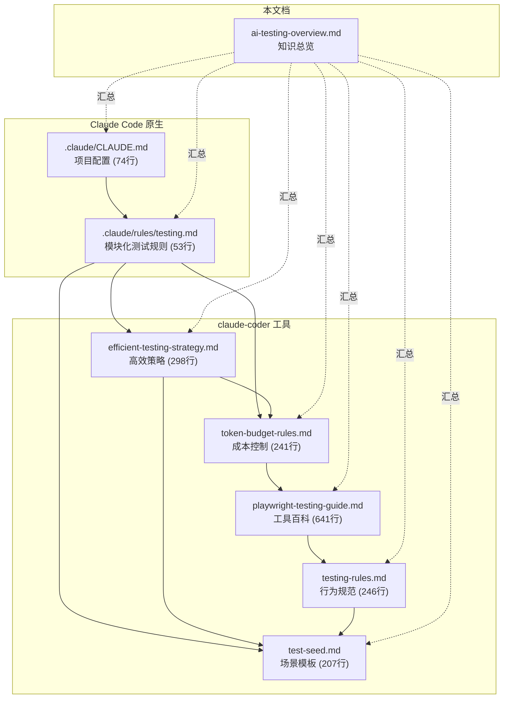
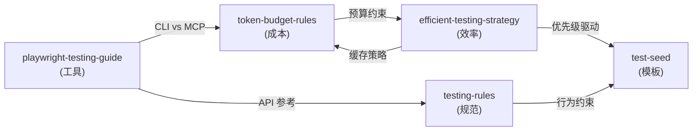
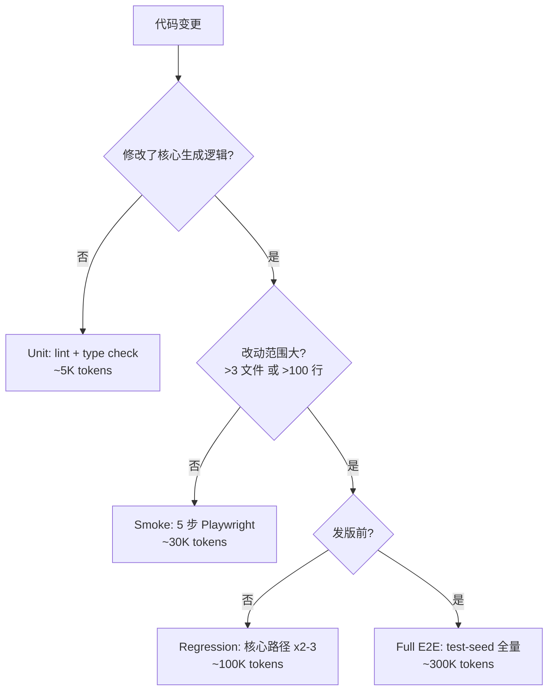

# AI Agent 自动化测试 — 知识总览

> **读者**: 开发者、架构师、对 AI Agent 测试感兴趣的技术人员
> **阅读时间**: 10-15 分钟
> **定位**: 汇总文档，提供全景理解；深入细节请跳转至各专项文档

---

## 第一章：全景概览

**一句话**: AI Agent 自动化测试 = 让 AI 编码助手（Claude Code / claude-coder / Cursor）通过浏览器自动化工具（Playwright）代替人类执行端到端测试，同时严格控制 token 成本。

### 1.1 与传统自动化测试的三个本质区别

| 维度 | 传统自动化测试 | AI Agent 自动化测试 |
|------|-------------|-------------------|
| **成本模型** | 一次编写、反复执行（边际成本趋零） | 每次执行消耗 token/API 调用（边际成本恒定） |
| **确定性** | 相同输入 → 相同输出（确定性） | LLM 输出非确定性，需要统计方法验证 |
| **测试编写者** | 人类编写测试脚本 | AI Agent 自主生成并执行测试步骤 |

### 1.2 文档体系全景



---

## 第二章：学术前沿 — AgentAssay 论文

**一句话**: AgentAssay 证明了 AI Agent 测试可以在不牺牲统计严谨性的前提下，将 token 成本降低 78-100%。

### 2.1 论文信息

| 项目 | 内容 |
|------|------|
| **标题** | AgentAssay: Token-Efficient Regression Testing for Non-Deterministic AI Agent Workflows |
| **地址** | https://arxiv.org/abs/2603.02601 |
| **作者** | Varun Pratap Bhardwaj |
| **日期** | 2026 年 3 月 3 日 |
| **代码** | PyPI: `agentassay` v0.1.0 (Apache-2.0) |
| **规模** | 20,000+ 行 Python, 751 测试, 10 框架适配器 |
| **实验** | 5 个 LLM（GPT-5.2, Claude Sonnet 4.6, Mistral-Large-3, Llama-4-Maverick, Phi-4）, 7,605 trials |

### 2.2 三个核心发现

| 发现 | 方法 | 效果 | 与本项目的对应 |
|------|------|------|--------------|
| **行为指纹** | 将执行轨迹映射为紧凑向量，多维度检测回归 | 检测力 86%（二值测试仅 0%） | `efficient-testing-strategy.md` 第六节测试缓存 |
| **SPRT 序贯分析** | 用统计假设检验替代固定次数测试 | 减少 78% 测试试次 | `token-budget-rules.md` 分层策略思想 |
| **Trace-First 离线分析** | 先录制执行轨迹，后续零成本离线分析 | **100% 成本节省** | `token-budget-rules.md` 第五节直接应用 |

### 2.3 关键创新：三值判定

传统测试只有 PASS / FAIL。AgentAssay 引入第三种状态 **INCONCLUSIVE**（不确定），承认 LLM 的非确定性本质，用置信区间量化结果可靠度。

---

## 第三章：工具全景对比

**一句话**: Claude Code 是官方 IDE 集成工具，claude-coder 是自动化循环引擎，Playwright 是浏览器控制层——三者分工明确、互相配合。

### 3.1 开发工具对比

| 维度 | Claude Code | claude-coder | Cursor |
|------|------------|-------------|--------|
| **定位** | Anthropic 官方 CLI 编码工具 | 第三方自运行循环 Agent | AI 增强 IDE |
| **配置文件** | `.claude/CLAUDE.md` + `.claude/rules/` | `.claude-coder/tasks.json` + 文档集 | `.cursor/rules/` |
| **测试能力** | 通过 MCP 调用 Playwright | 任务驱动 + 自动测试验证 | 通过 MCP 调用 Playwright |
| **规则加载** | 自动读 CLAUDE.md + rules/ 目录 | 读 tasks.json 步骤中引用的文档 | 读 .cursor/rules/ |
| **Token 管理** | 内置（月度配额） | 需手动预算控制 | 按订阅计划 |
| **适合场景** | 交互式开发 + 测试 | 无人值守批量任务 | 日常编码 |

### 3.2 Playwright 两种模式

| 维度 | Playwright MCP | Playwright CLI |
|------|---------------|----------------|
| **每测试 token** | ~114,000 | ~27,000 |
| **效率比** | 1x | **4x** |
| **Snapshot 处理** | 注入 LLM 上下文（50-500KB/次） | 存磁盘为 YAML（仅返回文件路径） |
| **工具 schema** | 26+ 工具完整 JSON schema 预加载 | `--help` 按需发现 |
| **操作响应** | 完整 accessibility tree + 元数据 | 单行确认（"Clicked e22"） |
| **集成方式** | `.mcp.json` 配置 MCP Server | Shell 命令 / Skills |
| **安装** | `npx @playwright/mcp@latest` | `npm i -g @playwright/cli@latest` |

**上下文膨胀示意**:

```
MCP 10 步测试:
  每步返回 accessibility tree → 8K tokens × 10 = 80K tokens（仅在 snapshot 上）

CLI 10 步测试:
  每步返回 "Clicked e22" → 20 tokens × 10 = 200 tokens
  仅按需读 YAML 时才增加上下文
```

### 3.3 工具选型决策

| 场景 | 推荐 | 原因 |
|------|------|------|
| 首次搭建/调试 | MCP | 反馈丰富，交互式 |
| 短测试（<5 步） | MCP | 差异不大，设置简单 |
| 长流程（≥5 步） | CLI | 节省 4x token |
| 多场景回归 | CLI | 总量大，必须节省 |
| 视觉验证 | MCP `--caps=vision` | 需要截图 + 视觉模型 |
| 探索性测试 | CLI | 步骤不可预测 |
| CI/CD | `npx playwright test` | 零 AI token 消耗 |

> 详见 `playwright-testing-guide.md` 第六部分

---

## 第四章：Coding Plan 与 Token 经济学

**一句话**: 即使订阅了 Coding Plan，token 也不是无限的——用分层策略和铁律控制成本，把 75% 的预算花在产出上。

### 4.1 月度预算分配

```
总预算 100%
├── 功能开发  60%   ← 核心产出
├── 测试验证  25%   ← 质量保障
├── 调试修复  10%   ← 问题定位
└── 文档/探索  5%   ← 知识积累
```

### 4.2 单 Session 预算上限

| Session 类型 | Token 上限 | API 调用上限 |
|-------------|-----------|-------------|
| 小功能实现 | 200K | 30 次 |
| 大功能实现 | 500K | 60 次 |
| Smoke 测试 | 150K | 20 次 |
| Full E2E 测试 | 400K | 50 次 |
| 代码审查 | 100K | 15 次 |
| Bug 修复 | 300K | 40 次 |

### 4.3 七条 Token 节省铁律

| # | 铁律 | 节省 |
|---|------|------|
| 1 | 合并 2-3 个操作后再 snapshot，不要每步都 snapshot | 40-60% |
| 2 | 长流程（>5 步）用 CLI 替代 MCP | 75% |
| 3 | 先读代码确认逻辑，再用浏览器验证 | 避免无效测试 |
| 4 | 不要反复读相同文件 | 50%+ |
| 5 | Shell 输出用 `head -n 50` 截断 | 防止 >10K |
| 6 | 上次通过的测试不重复执行 | 100% |
| 7 | 测试数据复用，不要每次重新生成 | 避免重复 LLM 调用 |

### 4.4 六个反模式（禁止）

| 反模式 | 替代方案 |
|--------|---------|
| 每步 `browser_snapshot`（10 步 = 80K） | 关键节点才 snapshot |
| MCP 做 20+ 步长流程（>200K） | 用 CLI |
| 反复 navigate 同一页面 | 在同一页面完成所有操作 |
| 读取 >500 行的完整大文件 | grep 定位后读片段 |
| 失败后无目标地反复重试 | 先分析日志，定向修复 |
| 每次测试都等 LLM 重新生成 PPT | 用已有 PPT 验证预览/下载 |

> 详见 `token-budget-rules.md` 第四节

---

## 第五章：高效测试方法论

**一句话**: 用 20% 的测试场景捕获 80% 的关键缺陷，Smart Snapshot 省 67% token，指数退避等待省 4.5x 成本。

### 5.1 AI Agent 测试金字塔

```
          /\           E2E Smoke     ~100K tokens | 每个重大功能后/每日
         /  \
        /----\         Integration   ~30K tokens  | 每个功能后
       /      \
      /--------\       Unit/Lint     ~5K tokens   | 每次代码修改后
     /  代码检查  \
    /--------------\
```

| 层级 | 执行方式 | 频率 | Token |
|------|---------|------|-------|
| Unit | Shell: lint + type check + pytest | 每次修改 | ~5K |
| Integration | Playwright CLI/MCP（≤5 步） | 每个功能 | ~30K |
| E2E Smoke | test-seed.md 全场景 | 重大节点 | ~100K |

### 5.2 Smart Snapshot 策略

| 级别 | 何时 | Token |
|------|------|-------|
| **必须** | 首次加载页面、关键断言点、操作失败时 | 开销值得 |
| **可选** | 中间操作后（fill 确认） | 按需 |
| **跳过** | 连续同类操作间、等待循环中 | 不值得 |

**效果对比**:
- 低效: navigate → snapshot → fill → snapshot → select → snapshot → click → snapshot = **6 次 ≈ 30K**
- 高效: navigate → snapshot → fill → select → click → wait_for → snapshot = **2 次 ≈ 10K**

> 详见 `efficient-testing-strategy.md` 第二节

### 5.3 场景优先级

| 优先级 | 示例 | 预算策略 |
|--------|------|---------|
| P0 | 文字 → 生成 PPT → 下载 | **必测** |
| P1 | API Key 缺失/无效错误处理 | 必测 |
| P2 | 英语学科生成、图片上传 | 按需 |
| P3 | 历史记录、设置页 | 低优先 |

**预算映射**: >200K → P0+P1+P2 | 100-200K → P0+P1 | <100K → 仅 P0

### 5.4 三种等待策略对比

| 策略 | Token 消耗 | 适用场景 |
|------|-----------|---------|
| `browser_wait_for` | **~5K**（1 次 snapshot） | 推荐：大多数场景 |
| 指数退避轮询 | ~20K（4 次 snapshot） | 需要观察中间状态 |
| Shell 端 API 检查 | ~5.5K（curl + 1 次 snapshot） | 有状态查询 API 时 |

对比：每 10 秒轮询 180 秒 = 18 次 snapshot = **~90K**（最差方案）

### 5.5 Early Exit + 结果缓存

**阻断性错误（立即停止）**: 服务未启动、500 错误、凭证缺失、页面空白
**非阻断性错误（记录继续）**: 样式异常、console warning、慢响应

**缓存机制**: 测试通过 → 记录 code_hash → 下次 git diff 无变更 → 标记 `SKIP (cached pass)`

> 详见 `efficient-testing-strategy.md` 第五、六节

---

## 第六章：文档对比矩阵

**一句话**: 5 份文档各有分工——成本控制 / 行为规范 / 场景模板 / 工具百科 / 策略优化，按需查阅。

### 6.1 核心对比

| 文档 | 行数 | 定位 | 读者 | 核心内容 | 何时查阅 |
|------|------|------|------|---------|---------|
| `token-budget-rules.md` | 241 | 成本控制 | Agent + 人 | session 预算、铁律、Trace-First | 规划测试预算时 |
| `testing-rules.md` | 246 | 行为规范 | Agent | 四大原则、工具清单、报告格式 | Agent 执行测试前必读 |
| `test-seed.md` | 207 | 场景模板 | Agent | 5 个可执行场景（A-E）+ 失败处理 | Agent 按步骤执行 |
| `playwright-testing-guide.md` | 641 | 工具百科 | Agent + 人 | MCP/CLI 全 API、方法论、配置模板 | 查阅 API 参数和配置 |
| `efficient-testing-strategy.md` | 298 | 策略优化 | Agent + 人 | Smart Snapshot、优先级、缓存 | 优化测试效率时 |

**辅助文档**:

| 文档 | 行数 | 归属 | 说明 |
|------|------|------|------|
| `.claude/CLAUDE.md` | 74 | Claude Code | 项目级配置（WHAT/WHY/HOW） |
| `.claude/rules/testing.md` | 53 | Claude Code | 模块化规则，YAML frontmatter 按路径自动加载 |

### 6.2 阅读顺序建议

**开发者（快速上手）**:
1. 本文档（全景理解）
2. `test-seed.md`（看具体场景长什么样）
3. `token-budget-rules.md` 第七节（决策流程图）

**架构师（深入理解）**:
1. 本文档（全景理解）
2. AgentAssay 论文（学术前沿）
3. `playwright-testing-guide.md` 第六部分（MCP vs CLI 原理）
4. `efficient-testing-strategy.md`（策略设计）

**AI Agent（执行测试）**:
1. `testing-rules.md`（行为铁律）
2. `token-budget-rules.md`（预算控制）
3. `efficient-testing-strategy.md`（效率优化）
4. `test-seed.md`（按步骤执行）
5. `playwright-testing-guide.md`（查阅 API）

### 6.3 文档内容交叉关系



**互补关系**:
- `token-budget-rules` 回答 **"花多少"**
- `efficient-testing-strategy` 回答 **"怎么省"**
- `testing-rules` 回答 **"怎么做"**
- `test-seed` 回答 **"做什么"**
- `playwright-testing-guide` 回答 **"用什么"**

---

## 第七章：速查手册

### 7.1 决策流程：代码变更后该跑什么测试



### 7.2 Playwright MCP 常用工具 Top 8

| 工具 | 用途 | 关键参数 |
|------|------|---------|
| `browser_navigate` | 打开页面 | `url` |
| `browser_snapshot` | 获取页面结构 | 无 |
| `browser_click` | 点击元素 | `ref`, `element` |
| `browser_fill_form` | 批量填写表单 | `fields[]` |
| `browser_select_option` | 选择下拉项 | `ref`, `values[]` |
| `browser_wait_for` | 等待条件满足 | `text`, `timeout` |
| `browser_console_messages` | 检查控制台 | `level` |
| `browser_file_upload` | 上传文件 | `paths[]` |

### 7.3 Playwright CLI 常用命令 Top 8

| 命令 | 用途 | 示例 |
|------|------|------|
| `open` | 打开页面 | `playwright-cli open http://localhost:3000` |
| `snapshot` | 页面快照存 YAML | `playwright-cli snapshot` |
| `click` | 点击 | `playwright-cli click e22` |
| `fill` | 填写 | `playwright-cli fill e15 "内容"` |
| `select` | 选择 | `playwright-cli select e18 "数学"` |
| `screenshot` | 截图 | `playwright-cli screenshot` |
| `console` | 控制台日志 | `playwright-cli console` |
| `network` | 网络请求 | `playwright-cli network` |

### 7.4 tasks.json 测试步骤模板

```json
{
  "id": "feat-xxx",
  "description": "功能 X 端到端测试",
  "budget": { "max_tokens": 150000, "test_tier": "smoke" },
  "steps": [
    "【效率规则】阅读 .claude-coder/efficient-testing-strategy.md",
    "【预算控制】阅读 .claude-coder/token-budget-rules.md",
    "【缓存检查】读取 record/test_cache.json，跳过已通过的场景",
    "【环境检查】curl localhost:8000/health && curl localhost:3000",
    "【P0 测试】执行 test-seed.md 场景 A，使用 Smart Snapshot",
    "【结果记录】更新 record/test_cache.json 和 e2e_test_results.md",
    "【预算检查】消耗 >80% 时跳过低优先级，记录 session_result.json"
  ]
}
```

### 7.5 混合工作流三阶段

| 阶段 | 工具 | 目标 |
|------|------|------|
| **开发期** | Playwright MCP | 交互式调试，建立 baseline |
| **回归期** | Playwright CLI | 批量执行，节省 token |
| **CI/CD** | `npx playwright test` | 零 AI token 消耗 |

---

## 附录：参考文献与资源

| 资源 | 链接 |
|------|------|
| AgentAssay 论文 | https://arxiv.org/abs/2603.02601 |
| AgentAssay PyPI | https://pypi.org/project/agentassay/ |
| Playwright MCP vs CLI 分析 | https://medium.com/@scrolltest/playwright-mcp-burns-114k-tokens-per-test-the-new-cli-uses-27k-heres-when-to-use-each-65dabeaac7a0 |
| Claude Code CLAUDE.md 指南 | https://code.claude.com/docs/en/memory |
| Claude Code Rules 目录 | https://claude-blog.setec.rs/blog/claude-code-rules-directory |
| AI Agent 测试金字塔 | https://medium.com/@derekcashmore/the-ai-agent-testing-pyramid-a-practical-framework-for-non-deterministic-systems-276c22feaec8 |
| Playwright CLI 深度解析 | https://testdino.com/blog/playwright-cli/ |
