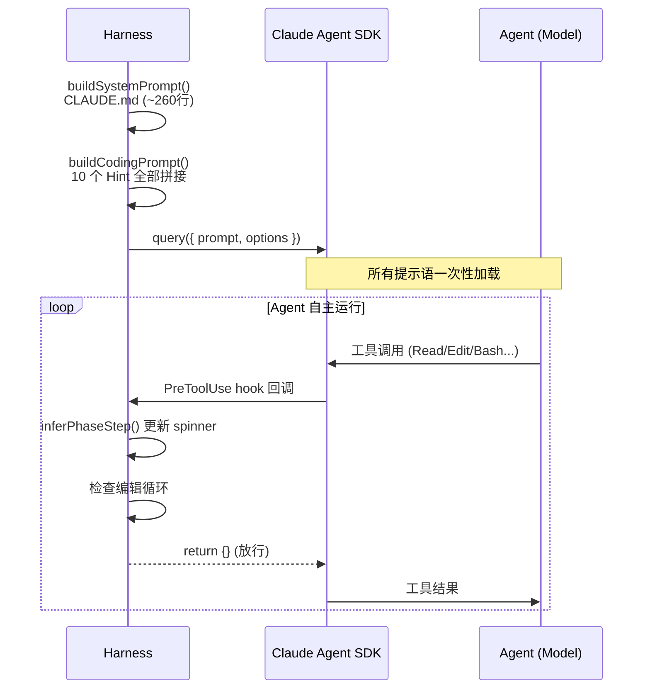
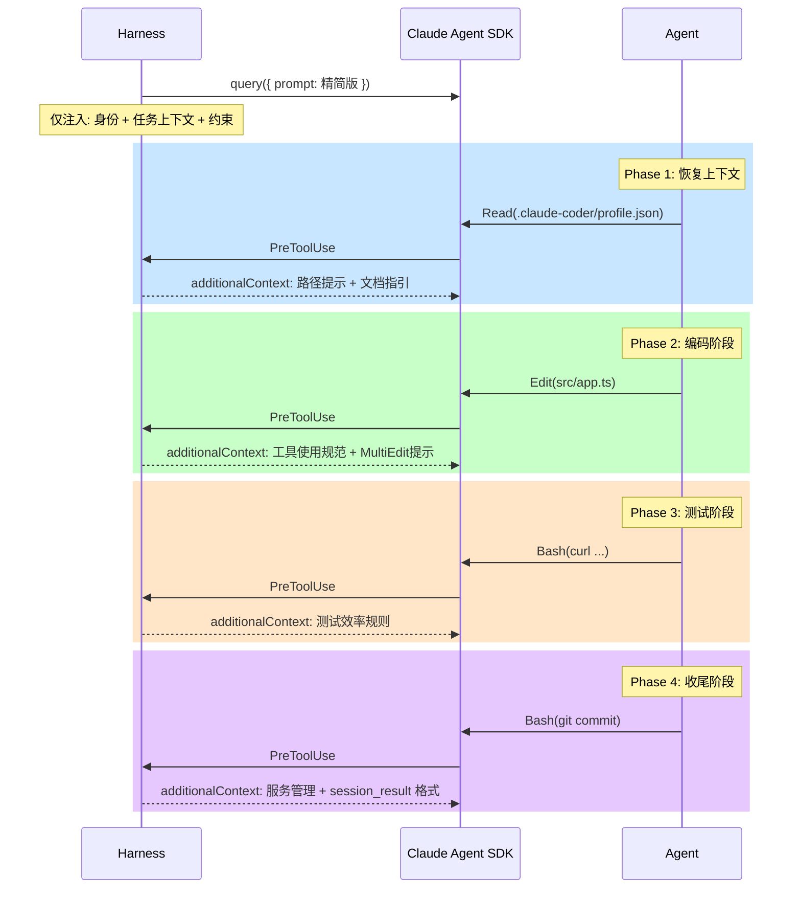

# 分阶段提示语注入 — 技术调研与方向探讨

> 状态：调研阶段，仅探讨，未实现
> 日期：2026-03-04
> 背景：当前所有 10 个 Hint 在 session 开始前一次性注入 user prompt。本文探讨利用 Hook 的 `additionalContext` 能力，将提示语拆分到不同阶段按需注入。

---

## 1. 当前架构

### 提示语注入时机



### 问题

| 问题 | 说明 |
|------|------|
| **Token 浪费** | 10 个 Hint 全部注入 user prompt，但大部分 Hint 仅在特定阶段有用（如 testHint 仅 Step 5 需要） |
| **注意力稀释** | 一次性注入大量指令，模型在真正需要某条指令时可能已"忘记"（context rot） |
| **时机错位** | 工具使用指导（Hint 10）在 Agent 还没开始读文件时就注入了，但 Agent 在 Step 4 编码阶段才真正需要这些规则 |
| **无法纠正** | 当前 Hook 仅用于监控和死循环拦截，无法在 Agent 做出低效工具选择时即时纠正 |

---

## 2. Hook 能力盘点

### SDK 内联 Hook（当前使用方式）

通过 `query()` 的 `options.hooks` 定义，进程内回调：

```javascript
sdk.query({
  prompt,
  options: {
    hooks: {
      PreToolUse: [{ matcher: '*', hooks: [async (input) => { ... }] }],
      PostToolUse: [{ matcher: '*', hooks: [async (input) => { ... }] }],
    }
  }
});
```

| Hook 事件 | SDK 内联支持 | 能力 |
|-----------|-------------|------|
| `PreToolUse` | 是 | `permissionDecision` (allow/deny/ask), `message`, **`additionalContext`** (v2.1.9+), `updatedInput` |
| `PostToolUse` | 是 | `decision` (block), `reason`, **`additionalContext`** |
| `UserPromptSubmit` | 是 | `decision` (block), `reason`, `additionalContext` |
| `Stop` | 是 | `decision` (block), `reason` |
| `SessionStart` | **否** (仅 CLI 声明式) | 不适用 |
| `SessionEnd` | **否** (仅 CLI 声明式) | 不适用 |

### `additionalContext` 关键特性

- **作用**: 将文本注入 Agent 的 context window，Agent 在后续推理中可以看到并遵循
- **注入位置**: 作为工具调用的附加上下文出现，紧邻工具结果
- **注意力**: 因为紧跟当前工具调用，处于模型注意力的高峰区域（recency zone）
- **限制**: 2026年1月新增，可能存在边缘 bug

### `decision: 'block'` + `message`（当前已在用）

- **作用**: 阻止工具调用，`message` 作为错误反馈传回模型
- **注意力**: 模型会将其视为"操作失败"信息，遵循率高
- **适用场景**: 拦截不当操作并引导替代方案

---

## 3. 提议架构：分阶段注入

### 核心思想

**按 Agent 的工作阶段，在 Hook 中按需注入对应阶段的提示语。** 初始 prompt 仅包含最核心的内容（身份、任务、约束），其余指导在 Agent 进入相应阶段时即时注入。



### Hint 拆分方案

| # | Hint | 当前位置 | 建议注入时机 | 注入方式 |
|---|------|----------|-------------|----------|
| 1 | `reqSyncHint` | user prompt | **保留在 user prompt** | 需求变更需要在 Step 1 就知道 |
| 7 | `taskHint` | user prompt | **保留在 user prompt** | 任务上下文是 Agent 开始工作的前提 |
| 8 | `memoryHint` | user prompt | **保留在 user prompt** | 上次会话记忆需要一开始就有 |
| 5 | `envHint` | user prompt | **保留在 user prompt** | Step 2 环境检查需要一开始就知道 |
| 2 | `mcpHint` | user prompt | PreToolUse (Bash: curl/test) | 测试时才需要知道 Playwright 可用 |
| 3 | `testHint` | user prompt | PreToolUse (Bash: curl/test) | 测试时才需要避免重复验证 |
| 4 | `docsHint` | user prompt | PreToolUse (Read: 首次读文件) | 读文件时提醒先读文档 |
| 6 | `retryContext` | user prompt | **保留在 user prompt** | 重试上下文需要一开始就有 |
| 9 | `serviceHint` | user prompt | PreToolUse (Bash: git) | 收尾时才需要知道是否停服务 |
| 10 | `toolGuidance` | user prompt | PreToolUse (首次工具调用) | 开始使用工具时注入 |

**结论**: 10 个 Hint 中，5 个适合保留在初始 prompt（1, 5, 6, 7, 8），5 个适合延迟注入到 Hook（2, 3, 4, 9, 10）。

### 实现草案

```javascript
// session.js - PreToolUse hook 增强版（概念代码，仅供讨论）
const injected = new Set(); // 跟踪已注入的 Hint，每个仅注入一次

hooks: {
  PreToolUse: [{
    matcher: '*',
    hooks: [async (input) => {
      const name = input.tool_name;
      const toolInput = input.tool_input || {};
      let additionalContext = '';

      // --- Phase: 读取文件 → 注入文档指引 ---
      if (['Read', 'Glob', 'Grep', 'LS'].includes(name) && !injected.has('docs')) {
        additionalContext += docsHint;      // Hint 4
        injected.add('docs');
      }

      // --- Phase: 首次工具调用 → 注入工具使用规范 ---
      if (!injected.has('toolGuide')) {
        additionalContext += '\n' + toolGuidance;  // Hint 10
        injected.add('toolGuide');
      }

      // --- Phase: 测试阶段 → 注入测试规则 ---
      if (name === 'Bash') {
        const cmd = toolInput.command || '';
        if ((cmd.includes('curl') || cmd.includes('test') || cmd.includes('pytest'))
            && !injected.has('test')) {
          additionalContext += '\n' + testHint;   // Hint 3
          additionalContext += '\n' + mcpHint;    // Hint 2
          injected.add('test');
        }

        // --- Phase: Git 操作 → 注入收尾提示 ---
        if (cmd.includes('git ') && !injected.has('service')) {
          additionalContext += '\n' + serviceHint;  // Hint 9
          injected.add('service');
        }
      }

      // --- Bash 命令纠正（进阶） ---
      if (name === 'Bash') {
        const cmd = toolInput.command || '';
        if (/\bgrep\b/.test(cmd) && !cmd.includes('rg ')) {
          return {
            permissionDecision: 'deny',
            permissionDecisionReason: '请使用 Grep 工具替代 bash grep，效率更高且结果格式化更好。',
          };
        }
        if (/\bfind\b/.test(cmd)) {
          return {
            permissionDecision: 'deny',
            permissionDecisionReason: '请使用 Glob 工具替代 bash find。',
          };
        }
        if (/\bcat\b/.test(cmd) && !cmd.includes('<<')) {
          return {
            permissionDecision: 'deny',
            permissionDecisionReason: '请使用 Read 工具替代 bash cat。',
          };
        }
      }

      // --- 编辑循环检测（已有功能） ---
      // ... existing loop detection code ...

      // 注入上下文
      if (additionalContext.trim()) {
        return { additionalContext: additionalContext.trim() };
      }
      return {};
    }]
  }]
}
```

---

## 4. Bash 命令拦截：工具纠正的最短路径

在完整的分阶段注入之前，有一个**低成本高收益**的中间步骤：在 PreToolUse hook 中拦截 Agent 使用 Bash 执行低效命令（grep/find/cat/ls/head/tail），引导其使用专用工具。

### 行为矩阵

| Agent 执行 | Hook 行为 | 反馈给 Agent |
|------------|----------|-------------|
| `Bash: grep -r "pattern" .` | **deny** | "请使用 Grep 工具替代 bash grep" |
| `Bash: find . -name "*.ts"` | **deny** | "请使用 Glob 工具替代 bash find" |
| `Bash: cat src/app.ts` | **deny** | "请使用 Read 工具替代 bash cat" |
| `Bash: ls -la` | **deny** | "请使用 LS 工具替代 bash ls" |
| `Bash: head -20 file.txt` | **deny** | "请使用 Read 工具（支持 offset/limit）替代 bash head" |
| `Bash: npm test` | allow | -- |
| `Bash: git commit` | allow + additionalContext | 注入收尾提示 |

### 优势

- **确定性**: Hook 拦截是确定性的，不依赖模型是否"记住"了 prompt 中的工具规则
- **即时纠正**: 在 Agent 犯错的那一刻就纠正，而不是等它浪费完 context
- **渐进式**: 可以先实现拦截（deny + message），后续再加 additionalContext
- **非 Claude 模型必需**: qwen/deepseek 等模型对 prompt 的遵循率不如 Claude，但 deny 是硬性拦截，模型无法绕过

### 风险

| 风险 | 缓解方案 |
|------|----------|
| 误拦截合法 Bash 命令（如 `cat <<EOF` heredoc） | 正则匹配需要排除 heredoc、管道等场景 |
| 某些 grep 用法没有 Grep 工具替代（如 `grep -c`） | 只拦截简单模式，复杂 grep 放行 |
| 过度拦截导致 Agent 陷入循环 | 每种拦截最多触发 2 次，第 3 次放行 |

---

## 5. 与现有方案的对比

| 维度 | 当前方案 | 分阶段注入 | Bash 拦截纠正 |
|------|---------|-----------|-------------|
| 实现复杂度 | 低 | 高 | 中 |
| Token 效率 | 低（全量注入） | 高（按需注入） | 不变（不影响初始 prompt） |
| 注意力效果 | 中（U型优化） | 高（时机精准） | 高（即时纠正，deny 不可忽略） |
| 非 Claude 模型支持 | 中（靠 prompt） | 高（时机 + prompt） | **最高（硬性拦截）** |
| 风险 | 低 | 中（additionalContext 较新） | 低（deny 已验证） |
| 依赖 SDK 版本 | 无 | v2.1.9+（additionalContext） | 无（deny + message 已有） |

---

## 6. 建议路线图

### P0 — 立即可做（不依赖新 SDK 特性）

**Bash 命令拦截纠正**

在现有 PreToolUse hook 中增加 bash 命令检测，对 `grep`/`find`/`cat`/`ls`/`head`/`tail` 返回 `deny + message` 引导使用专用工具。这是最短路径、最高确定性的优化。

### P1 — 短期（需要验证 additionalContext）

**工具使用指导延迟注入**

将 Hint 10（toolGuidance）从初始 prompt 移到 PreToolUse hook 的 `additionalContext`，在 Agent 首次使用工具时注入。验证 `additionalContext` 在非 Claude 模型上的效果。

### P2 — 中期

**测试/收尾阶段指导延迟注入**

将 Hint 2/3/9 移到 PreToolUse hook，按阶段（test/git）触发注入。

### P3 — 远期

**完整分阶段注入**

所有可延迟的 Hint 通过 Hook 按需注入。初始 prompt 仅保留身份、任务、约束。配合 `additionalContext` 的 PostToolUse 版本，实现"编码后注入代码审查提示"等高级场景。

---

## 7. 学术/行业参考

| 来源 | 核心概念 | 与本方案的关联 |
|------|----------|---------------|
| Anthropic Context Engineering (2025) | Context 是有限资源，需精心管理 | 按需注入减少 context 浪费 |
| Claude Code System Prompt (gist) | 每个工具都有 "when to use / when NOT to use" 指导 | Hint 10 和 Bash 拦截复现这一设计 |
| SWE-Agent (2024) ACI | Agent-Computer Interface 设计应优化工具发现和使用 | Hook 即时纠正是 ACI 的运行时优化 |
| Anthropic "Writing effective tools for agents" (2025) | 工具设计影响 Agent 行为，工具在 context 中很显眼 | 扩展 allowedTools 让工具自然出现在模型视野 |
| ContextBench (2025) | 复杂脚手架边际收益递减 | 不过度设计分阶段注入，先做确定性拦截 |

---

## 8. 结论

当前 harness 的提示语架构已经相当成熟（U型注意力 + 10个条件Hint + recency zone 注入）。下一步优化的核心方向是**从"一次性全量注入"向"按需分阶段注入"演进**，但需要渐进式推进：

1. **先做 Bash 命令拦截**（P0）— 零风险，最高确定性，不依赖新 SDK 特性
2. **验证 `additionalContext`**（P1）— 确认非 Claude 模型是否能看到并遵循
3. **逐步迁移 Hint**（P2-P3）— 每次迁移一个 Hint，A/B 测试效果

**核心原则：确定性拦截（Hook deny）> 即时注入（additionalContext）> 初始 prompt 指导（Hint）> 系统 prompt 规则（CLAUDE.md）**

这个优先级排序体现了一个关键洞察：**越靠近行为发生的时刻，指导的遵循率越高**。
